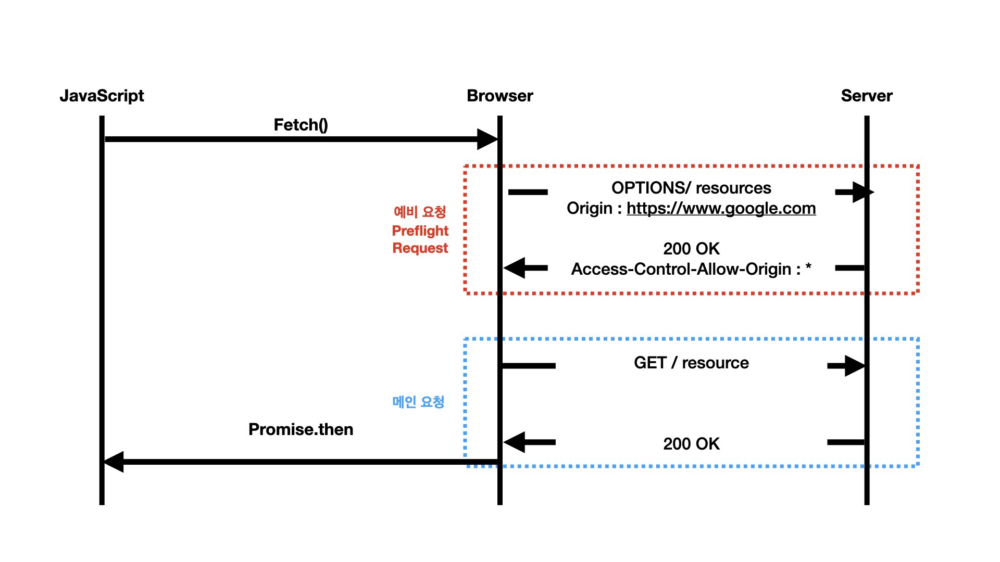

### Preflight Request(사전요청)

Preflight Request(사전요청)은 일반적으로 우리가 웹 애플리케이션을 개발을 할 때 마주치는 시나리오입니다.
이 시나리오에 해당하는 상황일 때 브라우저는 요청을 한번에
보내지 않고 예비 요청과 메인요청으로 나누어서 서버로 전송합니다. 이때 브라우저가 메인요청을 보내기 전에 
예비 요청을 합니다. 이것을 Preflight 사전요청이라고 부르는것입니다. 예비 요청에서는 HTTP 메소드 중에 
OPTIONS 라는 메소드가 사용이 됩니다. 사전 요청의 역할은
메인 요청을 보내기 전 브라우저 스스로 이 요청이 안전한
요청인지 확인 하는것 입니다.

밑에 그림을 보면 fetch api를 사용하여 브라우저에게
리소스를 받아오라는 명령을 내리면 브라우저는 서버에게 
사전요청을 먼저 보내고 서버는 이 사전 요청에 대한 
응답이로 어떤것들을 허용하고 어떤 것들이 금지가 되는 정보를 응답헤더에 담아서 브라우저에게 보내게 됩니다.

