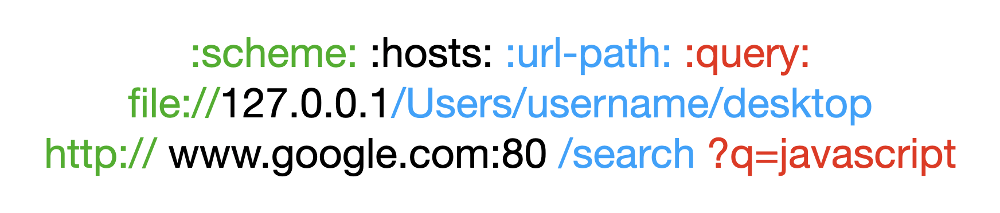

### URL과 URI

### URL(Uniform Resource Locator)
네트워크 상에서 웹 페이지, 이미지, 동영상 등의 파일이 위치한 정보를 나타냅니다.
URL은 scheme, hosts, url-path로 구분 할 수 있습니다.
- scheme은 통신 방식(프로토콜)을 결정합니다. 대표적으로 http(s)를 사용합니다.
- hosts는 웹 서버의 이름이나 도메인,IP를 사용하며
주소를 나타냅니다. 
- url-path는 웹 서버에서 지정한 루트 디렉토리부터 시작하여 웹 페이지, 이미지, 동영상 등이
위치한 경로와 파일명을 나타냅니다.

### URI(Uniform Resource Identifier)
URL의 기본 요소인 scheme, hosts, url-path에
query, bookmark 까지 포함한 것입니다.

- query는 웹 서버에 보내는 추가적인 질문 입니다.
http://www.google.com:80/search?q=JavaScript 를 브라우저의 검색창에 입력하면, 구글에서 JavaScript를 검색한 결과가 나타납니다.

URI는 URL을 포함하는 상위 개념이다.

|부분|명칭|설명|
|:---:|:---:|:---:|
file://, http://, https:// | scheme |통신 프로토콜
127.0.0.1, www.google.com	| hosts	| 웹 페이지, 이미지, 동영상 등의 파일이 위치한 웹 서버, 도메인 또는 IP
:80, :443, :3000|	port|	웹 서버에 접속하기 위한 통로
/search, /Users/username/Desktop|	url-path	|웹 서버의 루트 디렉토리로부터 웹 페이지, 이미지, 동영상 등의 파일이 위치까지의 경로
q=JavaScript	|query|	웹 서버에 전달하는 추가 질문