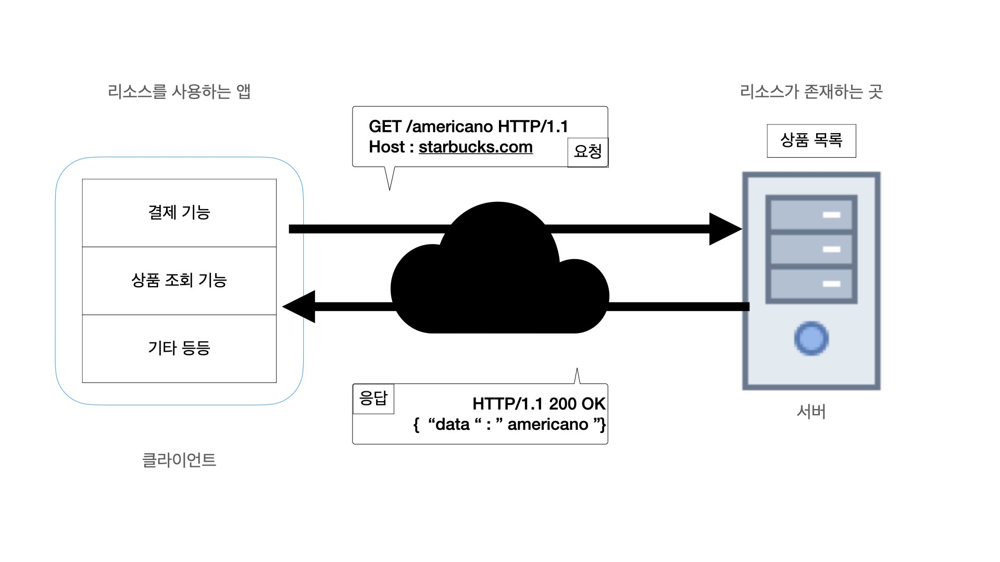

### 클라이언트-서버 통신과 API

클라이언트와 서버간의 통신은 요청과 응답으로 구성됩니다.
요청이 있어야 응답이 옵니다.

프로토콜은 통신 규약 즉, 약속 입니다.

웹 애플리케이션 아키텍처에서는 클라이언트 서버가
서로 HTTP라는 프로토콜을 이용해서 서로 대화를 나눕니다.
HTTP를 이용해 주고 받는 메시지는 "HTTP" 메시지 라고 부릅니다.

### API(Applicaiton Programming Interface)란??
서버는 클라이언트에게 리소스를 잘 활용할 수 있도록
인터페이스를 제공해 주는데 이것을 API입니다.

### HTTP API 디자인을 잘 하는 방법
HTTP API 디자인에는 Best Practice가 존재합니다.
HTTP 요청에는 메소드라는 것이 존재 합니다.
리소스를 그저 달라고 했을 때는 GET,
사용자를 추가해 달라고 했을 때는 CREATE,
지워달라고 하면 DELETE를 요청 할 수 있습니다. 마치 데이터베이스의 CRUD의 행동과 비슷합니다. 각각 CRUD의 행동과 일치하는 HTTP의 메소드의 종류가 존재합니다

| 요청 | 적절한 메소드 |
|:---:|:---:|
추가(CREATE) | POST
조회(READ) | GET
갱신(UPDATE) | PUT OR PATCH
삭제(DELETE) | DELETE

#### 사용자 관리 API의 예

|요청|URL 디자인|사용하는 메소드|
|:---:|:---|:---:|
모든 사용자 조회 | /users | GET
새 사용자 추가 | /users | POST
1번 사용자 정보 갱신 | /users/1 | PUT
1번 사용자 정보 삭제 | /users/1 | DELETE
1번 사용자 정보 조회 | /users/1| GET

