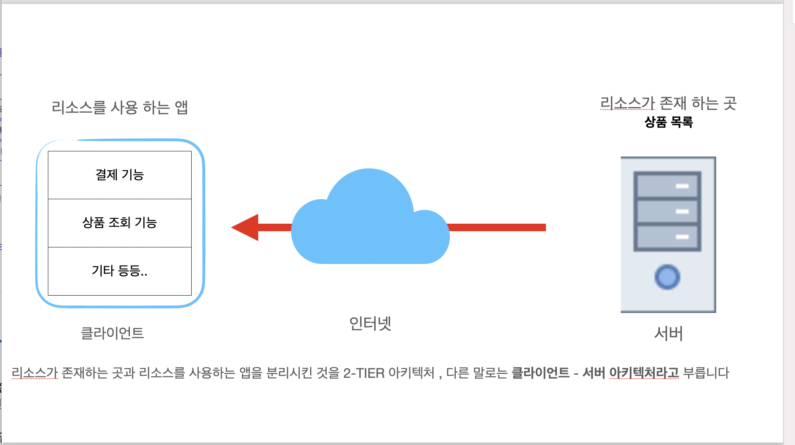
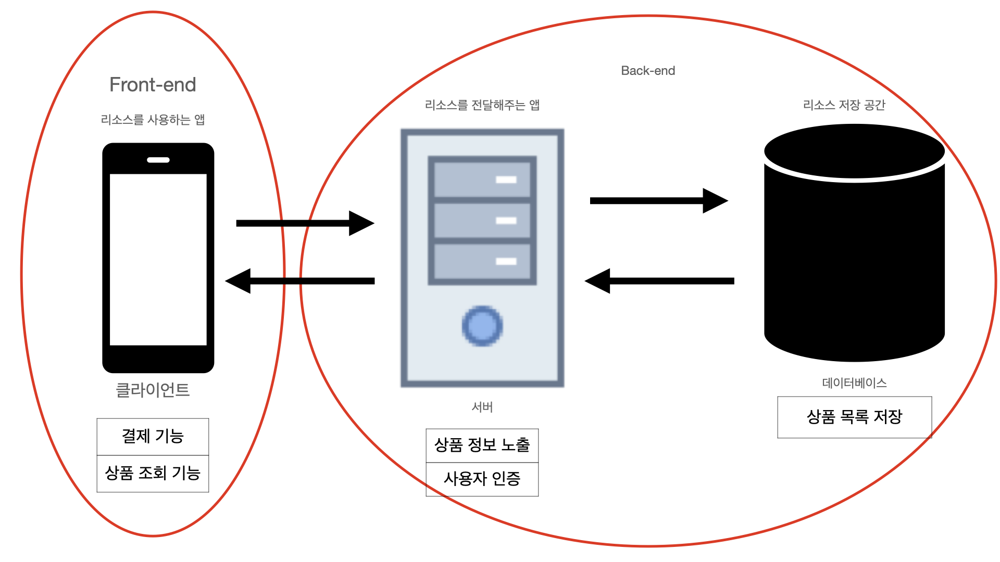

### 클라이언트-서버 아키텍처 

일반적으로 서버는 리소스를 전달해주는 역할만 담당합니다. 
리소스를 별도로 마련하는 곳을 데이터베이스 라고 부릅니다.
데이터베이스는 창고와 같은 역할을 합니다. 
기존 2티어 아키텍처에 데이터베이스가 추가된 형태를 3티어 아키텍처라고 합니다.

클라이언트 앱은 사용자가 눈으로 보고 대면하므로, 프론트엔드 영역, 
서버 앱은 사용자 눈에 직접 보이지 않게 뒤에서 작동을 하므로 백엔드 라고 부릅니다.