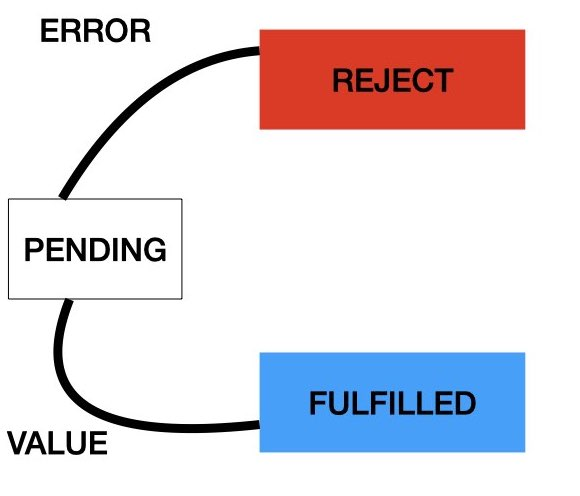

### Promise

### promise는 무엇인가?
자바스크립트에서는 비동기 프로그래밍을 위한 하나의 패턴으로 콜백을 사용을 하였다.
하지만 콜백 패턴은 비동기 처리 중 발생한 오류를 예외처리 하기 힘들고 
여러개의 비동기 로직을 한꺼번에 처리하는 데도 한계가 있기 때문에 다른 패턴인 Promise가 등장했다.

#### Promise는 비동기 처리 로직을 추상화 한 객체와 그것을 조작하는 방식을 말한다.

### 프로미스의 상태
- Pending : 성공도 실패도 아닌 상태, promise 객체가 생성된 초기 상태를 말한다.
- Fulfilled : 성공(resolve)했을 때의 상태, onFulfilled가 호출된다.
- Rejected : 실패(reject)했을 때의 상태, onRejected가 호 출된다.



### 프로미스 작성방법
```
function getData() {
  return new Promise((resolve, reject) =>{
  let data = 1;
    if(resolve){
      return data
    }if(reject){
      return err;
    }
  });
}

// resolve()의 결과 값 data를 resolvedData로 받음
getData().then((resolvedData) => {
  console.log(resolvedData); // 100
});
```


### 프로미스 여러개 연결 하기
```
new Promise((resolve, reject) =>{
  setTimeout(() =>{
    resolve(1);
  }, 2000);
})
.then((result) => {
  console.log(result); // 1
  return result + 10;
})
.then((result) => {
  console.log(result); // 11
  return result + 20;
})
.then((result) => {
  console.log(result); // 31
});
```