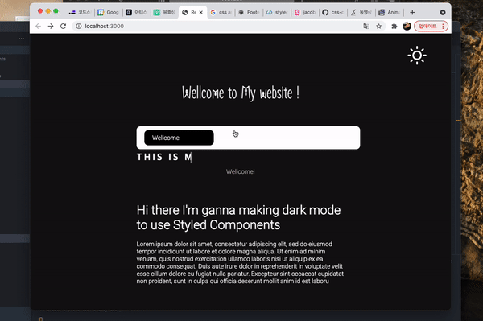

 

# TIL 2021 - 07 - 07 📖!

 
  
  
오늘 혼자 만들어본 건 styled component를 이용해서 웹사이트를 만들어 보았습니다 기존에 배웠던 것이랑
애니메이션을 추가 했고 거기에 다크모드를 연동시켜서 달과 해 아이콘을 누르면 색깔이 전체적으로 바뀌게끔 구현해보았습니다 ! 
코드를 적자니 너무 코드가 너무 많이 나와서 코드 파일만 올려놓겠습니다 ! 