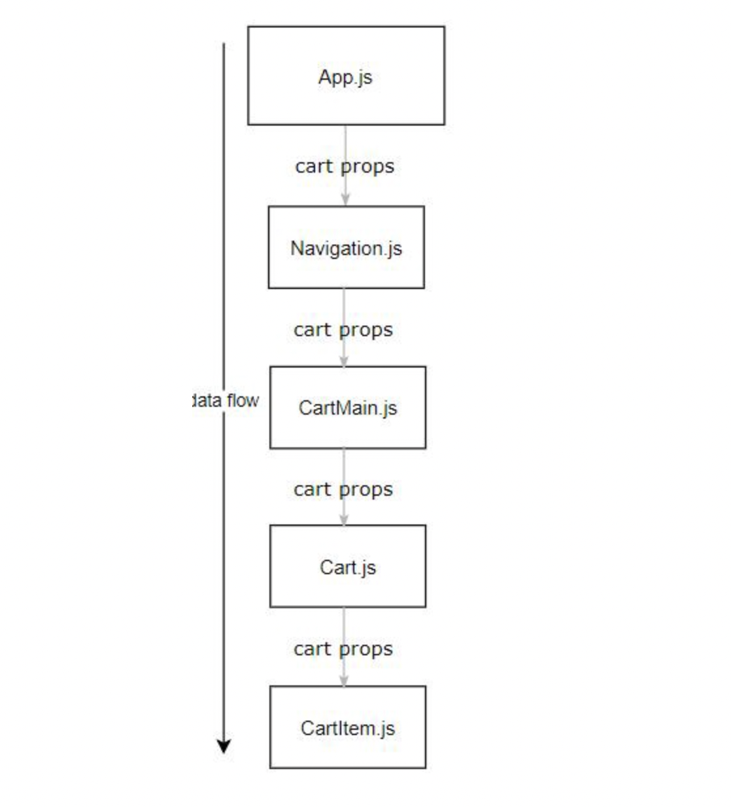
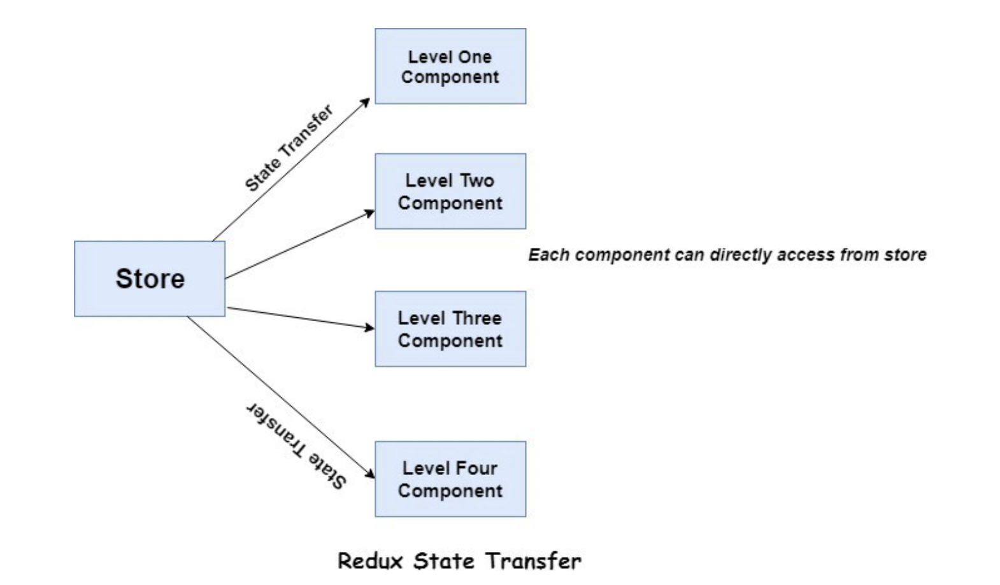

 

# TIL 2021 - 07 - 09 📖!
 
 * 스프린트 

 - Redux

- 리덕스란 무엇일까 ?
리덕스(Redux)는 Javascript app을 위한 예측가능한(predictable) state container이다. 리액트 뿐만 아니라 Augular, jQuery, vanilla JavaScript 등 다양한 framework와 작동되게 설계되었다. 즉, 리액트만을 위한 Library는 아니다.
한마디로 스테이트를 저장해주고 관릴를 해주는 녀석이다 

- 그렇다면 우리는 왜 리덕스를 필요로 할까 ?
(
 
  


리액트로만 프로젝트를 진행하게 될 경우 우리의 어플리케이션은 local state, 그리고 global state를 관리하기 어렵다.
props로만 상태를 내려주게 될 경우에는 깊이가 깊은 컴포넌트들에게는 상태 전달이 쉽지 않고 변수명도 꼬일 수 있으며
에러가 났을때 에러가 난곳을 찾기가 어렵다 또한 자식 컴포넌트 의 상태 변화에 따라 글로벌 상태 또한 변할 수 있기 때문에 상황에 따라서는 redux를 사용하는게 안전할 수 있다 깊이가 그다지 깊지 않은 프로젝트에서는 React hooks를 사용하는게 유용 할 수 있다 

- 리덕스의 세 가지 규칙

1. 스토어는 단 한개

- 스토어는 언제나 단 한개이다. 스토어를 여러 개 생성해서 상태를 관리하면 됩니다. 그 대신 리듀서를 여러 개를 만들어서 관리 할 수 있습니다

 

2. state는 읽기 전용

- 리덕스의 상태, state는 읽기 전용이다. 이 값은 절대로 직접 수정하면 안됩니다. 직접 수정을 하게 된다면 구독 함수를 제대로 실행하지 않거나 컴포넌트의 리렌더링이 되지 않을 수 있습니다.

- 상태를 업데이트 할 때는 언제나 새 상태 객체를 만들어서 넣어 주어야 합니다 업테이트를 할 때마다 새 객체를 만든다면 메모리 누수가 일어나지 않을까? 아닙니다. 이전에 사용하던 객체들이 메모리에 누적되지 않습니다 상태 레퍼런스가 사라지면 자동으로 메모리 관리를 합니다.

 

3. 변화는 순수 함수로 구성

- 모든 변화는 순수 함수로 구성해야 한다. 여기에서 함수는 리듀서 함수를 말합니다. 순수 함수에서 결과값을 출력할 때는 파라미터 값에만 의존해야 하며, 같은 파라미터는 언제나 같은 결과를 출력해야 합니다

- 예를 들어 리듀서 함수 내부에서 외부 네트워크와 데이터베이스에 직접 접근하면 안된다. 요청 실패 할 수도 있고, 외부 서버의 반환 값이 변할 수 있기 때문입니다.

- 리듀서 함수 내부에서는 현재 날짜를 반환하는 new Date() 함수나 Math.random() 함수 등도 사용 하면 안됩니다.

- 리덕스의 구조와 리덕스의 처리 과정을 알아 보자 우선 리덕스에는 Action, Store, Reducer가 있습니다.


. Actions(액션): 어플리케이션의 store(스토어), 즉 저장소로 data를 보내는 방법입니다. view에서 정의되어있는 액션을 호출하면 action creators(액션 생성자)는 어플리케이션의 state(상태)를 변경하여 준다. 공식문서에 나와있는 예제를 살펴봅시다.
const ADD_TODO = 'ADD_TODO' // action의 type을 정의
action의 type은 일반적으로 문자열 상수로 정의됩니다. 정의된 action type은 action creators(액션 생성자)를 통해 사용됩니다
```js
function addTodo(text) {
  return {
    type: ADD_TODO, //나는 이 데이터에는 이러한 이름을 줄거고
    text //이러한 형태로 보낼거야
  }
}
```

- Reducers(리듀서): action을 통해 어떠한 행동을 정의했다면, 그 결과 어플리케이션의 상태가 어떻게 바뀌는지는 특정하게 되는 함수입니다

```js
function todoApp(state = initialState, action) { 
  switch (action.type) {
  case SET_VISIBILITY_FILTER: // 어? 액션에서 이런 이름을 가진애를 
    return Object.assign({}, state, { //이렇게 처리해달라고 하고 있어 ! 
      visibilityFilter: action.filter
    });
  default:
    return state //그래서 나는 이렇게 처리 해서 보낼거야 ! 
  }
}
```
리듀서 함수에서는 action의 type에 따라 변화된 state를 반환하게 됩니다

- Store(스토어): “무엇이 일어날지”를 나타내는 action, 그리고 action에 따라 상태를 수정하는 reducer를 저장하는 어플리케이션에 있는 단 하나의 객체입니다
```js
import { createStore } from 'redux';
import todoApp from './reducers';

let store = createStore(todoApp); //스토어를 생성하고 생성한 스토
```
이처럼 store을 생성하고 reducer을 연결하여 어플리케이션에 연결하게 됩니다
