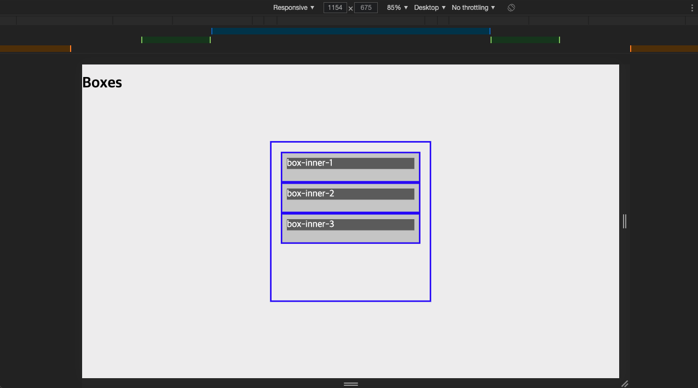

# TIL 2021 - 06 - 23 📖!

* ReactStudy

- Sass 강의 part 2 까지 들어보았습니다 
- Sass 를 사용하여 디바이스 화면 크기별로 박스 크기를 조정해주는 것을 해보았습니다 

이런식으로 크기를 늘리고 줄일때마다 변화하도록 만들었고 
여태까지 배운내용을 복습하며 통합해서 만들어 보았고 mixin과 Body base, extend를 각각의 폴더로 만들어 불러오는 형식으로 만들어서 
코드가 훨씬 간결해보이게끔 만들어줬습니다  이과정을 partial이라 하고 sass안에서의 if문도 만들어 보았습니다 

- 본격적인 리액트는 내일부터 할 예정입낟. ㅠ_ㅠ
