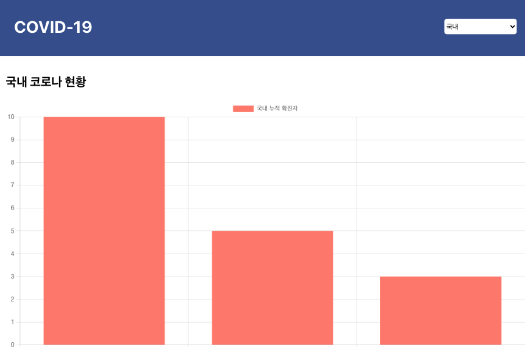

# TIL 2021 - 06 - 24 📖!

* ReactStudy
- 리액트는 코로나 바이러스 그래프를 구현해 보았습니다 comma 애러가 나긴했지만 잘 작동 했고 점점 완성도를 높혀 갈 예정입니다 
- postman으로 API를 가져오는 것도 해보았습니다 .

```js
const Contents = () => {
    const [confirmedData, setconfirmedData] = useState({
        labels: ["1월", "2월", "3월"],
        datasets:[
            {
                label:"국내 누적 확진자",
                backgroundColor: "salmon",
                fill: true,
                data: [10, 5, 3]
            },
        ]
    })


    useEffect(() => {
        const fetchEvents = async () => {
            const res = await axios.get("https://api.covid19api.com/total/dayone/country/kr")
            console.log(res)
        }
        fetchEvents();
    })
```
이렇게 구현을 해보았고 


리액트 기본정리를 해보았습니다

리액트는 컴포넌트 들이다.
Class를 이영해도 돼고 Function을 이용해서 만들 수 있다
class는 extends 해서 Function 컴포넌트는 app으로 쓰면된다 
Class는 상태가 있을때 함수 컴포넌트는 정적일때 
Class는 컴포넌트에서 가지고 있는 상태 데이터를 담을 수있는 State가 있다 그래서 업데이트 된것들을 보여주고 
life cycle메소드를 가지고 있어 컴포넌트의 상태에 따라 구현해줌 

함수형에는 state와 lifeCycle메소드가 없다 하지만 react에서 Reac Hook으로 상태를 저장 할 수 있다 lifeCycle메소드도 사용 할 수 있다 

Class를 이해하기 어려워서 scripting 언어를 사용하는 개발자들이 편하게끔 React Hook이 나왔다 
Class에서는 바인딩 이슈가 있어서 함수형 으로 하게 되었다 

기존에 많은 프로젝트 들이 class 컴포넌트로 되어있는게 많다 그래서 class 컴포넌트를 이해하는 것도 중요하다 . 팀마다 호불호가 있기때문에 둘다 다룰 줄 아는게 좋다 .

react hooks

useState 를 사용해서 선언을 해준다 
const [초기값, 변경함수] = useState(초기값으로 설정 하는값)
초기값이 변경 될 때마다 변경함수로 값을 받아와서 변경해준다

함수형 컴포넌트는 props나 state가 변경이되면 함수 전체가 반복된다 
만약 함수자체가 반복이 된다면 state값은 계속 초기화 되어야 하는거 아닌가 ?
useState는 react hook 에서 제공하는 Api로 useState를 계속 호출해도 그 값은 계속 저장이 되기 때문에 state는 초기화 되지 않는다 
useRef를 ㅎ사용하면 span과 같은 태그들을 읽을 수 있다
함수가 계속 변하게 되면 memo를 써도 함수 자체가 계속 변하기 때문에 side effect useCallback으로 자동으로 저장을해서 같은 함수를 반복하다 조금 조심히 써야한다 
useEffect는 컴포넌트가 마운트가 될 때마다 호출이되는 함수이다 
컴포넌트가 처음 마운트 되었을때 호출이 되고 업데이트가 될 때 마다 호출되는 함수이다 
두번째 인자에 어떤 값이 변경 되었을때만 호출되게 만들 수 있다
useEffect(() => {
    console.log(mounted);
}, [])텅빈 배열이면 처음에만 호출하는것 그리고 어떤 값을 넣으면 그 값이 변경 되었을때만 호출한다 .
리액트에서 컴포넌트란 웹어플리케이션, 웹페이지에서 독립적이고 재사용이 가능한 단위로(박스 단위로) 나뉘어진 블럭을 말한다


- scss공부는 
//기본 브라우저 fontsize는 16px 임 
// em : 해당 요소의 지정된 폰트 사이즈가 1em if fontsize가 20 이면 => 1em => 20px   박스크기 비교 해보기
// rem 10px이 1 rem임 html 기본 폰트사이즈가 30px이어서임 최상위 rem으로 단위를 주면 나중에 모바일이나 데크스탑에서 유동적으로 바꿔줄 수 있다 px주면 일일이 다 바꿔줘여하지만 rem으로 주면 html fontsize만 바꾸면 전체가 다 바뀐다 
// vw 
// vh 
// px:절대적인크기
- 단위 공부를 하고 SCSS를 이용한 프로젝트 진행중입니다
