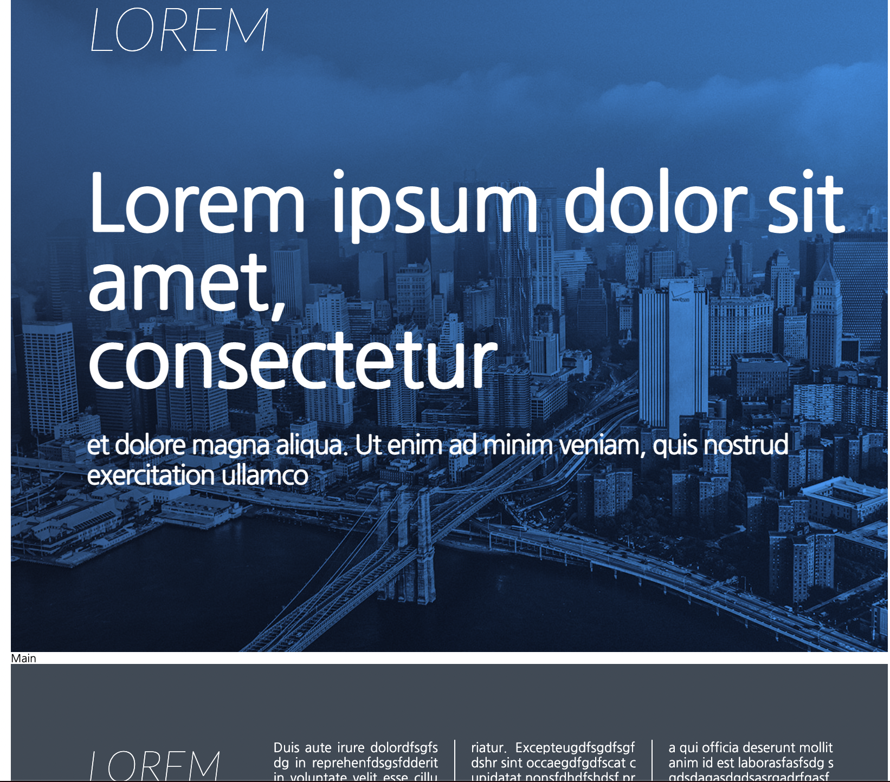

# TIL 2021 - 06 - 25 📖!

## ReactStudy
# SCSS
- 오늘은 SCSS를 이용해 Header와 Footer를 만들어 보았고 애니메이션과 트렌시션을 배웠습니다 

이렇게 구현 해보았습니다 .

# React 
- 코로나멥 만들기 클론 코딩은 콤마 오류를 제외한 모든 오류를 수정 하고 정상적으로 api로 들어온 데이터들을 가공 해서 쓸 수 있는 상태까지 만들어 놓았습니다
