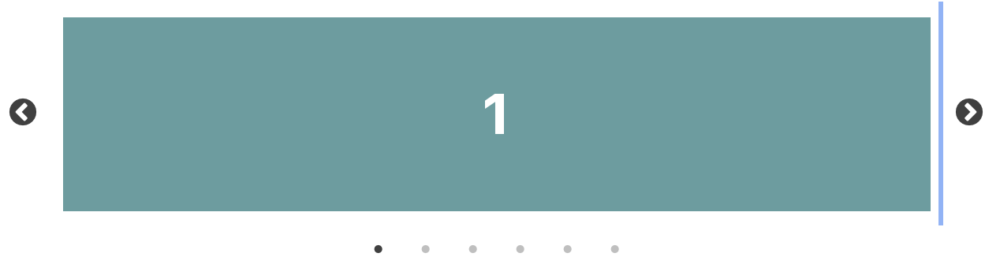

 

# TIL 2021 - 07 - 15 📖 !

이번에는 HA가 끝나고 새롭게 구현해 보고 싶었던 사진 슬라이드 를 구현해 보려고 했다 하지만 잘 되지 않아서 검색해본 결과 slick이라는 라이브러리가 있었다 그래서 오늘은 슬릭이라는 라이브러리에 대해 이야기 해보려 한다

이분의 벨로그를 보고 작성을 해보았습니다 
https://velog.io/@cookncoding/React-slick%EC%97%90-styled-components-%EC%A0%81%EC%9A%A9%ED%95%98%EA%B8%B0#slick

- React Slick 과 Carausel

캐러셀이란 회전 목마라는 뜻을 가지고 있으며 슬라이드 형태로 순환하며 이미지나 영상등을 보여주는 것을 의미한다. 다른 이름으로는 이미지 로테이터, 슬라이더 등 다양한 이름으로 불리는데 슬라이더로 검색하면 볼륨 조절하는 슬라이더가 나오므로 캐러셀이라고 하는 것 같다.

예를 들면 넷플릭스 영화 목록을 보여주는 것 또한 케러셀이다.

설치 방법 
npm

``` npm install react-slick --save```

yarn

``` yarn add react-slick ```


npm

```npm install slick-carousel --save```

yarn

```yarn add slick-carousel```

케러셀을 사용하려면 carousel css 와 theme 을 import 해주어야 하는데 styled-Components를 사용하고 있다면 global에 import 하면 되지만 그렇지 않은 경우에는 사용하고자 하는 파일에서 import 해주면 된다 

예시로 
```js
import React, { Component } from "react";
import Slider from "react-slick";

export default class SimpleSlider extends Component {
  render() {
    const settings = {
      dots: true,
      infinite: true,
      speed: 500,
      slidesToShow: 1,
      slidesToScroll: 1
    };
    return (
      <div>
        <h2> Single Item</h2>
        <Slider {...settings}>
          <div>
            <h3>1</h3>
          </div>
          <div>
            <h3>2</h3>
          </div>
          <div>
            <h3>3</h3>
          </div>
          <div>
            <h3>4</h3>
          </div>
          <div>
            <h3>5</h3>
          </div>
          <div>
            <h3>6</h3>
          </div>
        </Slider>
      </div>
    );
  }
}
``` 
이렇게만 작성 해주어도 아래와 같은 슬라이더가 만들어진다 
 

settings는 속성값을 넣어주는건데 
```js
const settings = {
      dots: true, // 캐러셀이미지가 몇번째인지 알려주는 점을 보여줄지 정한다.
      infinite: true, // loop를 만들지(마지막 이미지-처음 이미지-중간 이미지들-마지막 이미지)
      speed: 500, // 애미메이션의 속도, 단위는 milliseconds
      slidesToShow: 1, // 한번에 몇개의 슬라이드를 보여줄 지
      slidesToScroll: 1 // 한번 스크롤시 몇장의 슬라이드를 넘길지
    };
```
 이렇게 적용이 가능하고 아래의 링크에서 더 많은 정보를 얻어 올 수 있다 

 [API](https://react-slick.neostack.com/docs/api/)
 <br>
  [Example](https://react-slick.neostack.com/docs/example/simple-slider/)

 또한 아래와 같이 styled-components를 적용한 것 도 볼 수 있다

```js
import React, {Component} from "react";
import styled from 'styled-components';
import Slider from "react-slick";
import 'slick-carousel/slick/slick.css';
import 'slick-carousel/slick/slick-theme.css';

const StyledSlider = styled(Slider)`
    .slick-slide div{
      outline: none; // 슬라이드 클릭시 파란선을 제거하기 위해서 작성
    }
`;
```

```js
import React, {Component} from "react";
import styled from 'styled-components';
import Slider from "react-slick";
import 'slick-carousel/slick/slick.css';
import 'slick-carousel/slick/slick-theme.css';

const Container = styled.div`
  overflow:hidden;
`;

const StyledSlider = styled(Slider)`
    .slick-slide div{
      outline: none;
    }
`;

const ImageContainer = styled.div`
  margin: 0 16px;
`;

const Image = styled.img`
max-width:100%;
max-height:100%;
`;

const imgUrl = require('./image/temp.jpg');

const items = [
  { id: 1, url: imgUrl },
  { id: 2, url: imgUrl },
  { id: 3, url: imgUrl },
  { id: 4, url: imgUrl },
  { id: 5, url: imgUrl },
  { id: 6, url: imgUrl },
  { id: 7, url: imgUrl },
  { id: 8, url: imgUrl },
  { id: 9, url: imgUrl },
  { id: 10, url: imgUrl },
];


export default class SimpleSlider extends Component {
  render() {
    const settings = {
      dots: true,
      infinite: true,
      speed: 500,
      slidesToShow: 1,
      slidesToScroll: 1,
      arrows: false,
      centerMode: true,
    };
    return (
      <Container>
        <h2> Single Item</h2>
        <StyledSlider {...settings}
        >
          {items.map(item => {
            return (
              <div key={item.id}>
                <ImageContainer>
                  <Image src={item.url} />
                </ImageContainer>
              </div>
            );
          })}
        </StyledSlider>
      </Container>
    );
  }
}
```
이런식으로 hooks를 사용해서 만들 수 도 있다 

내일한번 만들어서 올려봐야 겠다