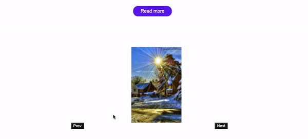

# TIL 2021 - 07 - 16 📖  !

- 오늘은 사진 슬라이드 기능에 대해 공부하고 기능을 구현해 보았다 우선 react Hooks 로 구현을 해보았는데 생각보다 쉽지 않았다 상태관리와 jpeg 파일로 전부 하나하나 만들어 주어야 해서 힘들었다 우선 



이런식으로 구현을 해보았는데 치명적인 단점이 있다 .
사진의 범위를 넘어가면 사진이 나오지 않는데 이부분을 조금만 더 보안하면 될 것 같다
그리고 사진들의 파일 이름을 전부 같게 해주고 뒤에 숫자로 count를 하는식으로 구현을 해서 숫자 범위를 다시 정해주어야 겠다 

코드는 

```js
function Thumbnail({source, alt}) {
    const [count, setCount] = useState(2)
    const handleClick = () => {
        setCount(count +1)
    }
   const disHandleClick = () => {
       setCount(count -1)
   }
    return (
   <>
    <Image src = {`${source}${count}.jpeg`} alt= {alt} className = 'thumbnail'/>
    <PrevBtn onClick = {disHandleClick}>Prev</PrevBtn>
    <NextBtn onClick = {handleClick}>Next</NextBtn>
    </>
    )
}
export default Thumbnail
```
```js

export const Slide = ({theme}) => {
    const [basicImages, setBasicImages] = useState(images[0])
    return ( 
     <Thumbnail source = {basicImages.src} alt = {basicImages.alt} key ={basicImages.id} theme= {theme}  />
    )
}

이렇게 구현을 해보았따 