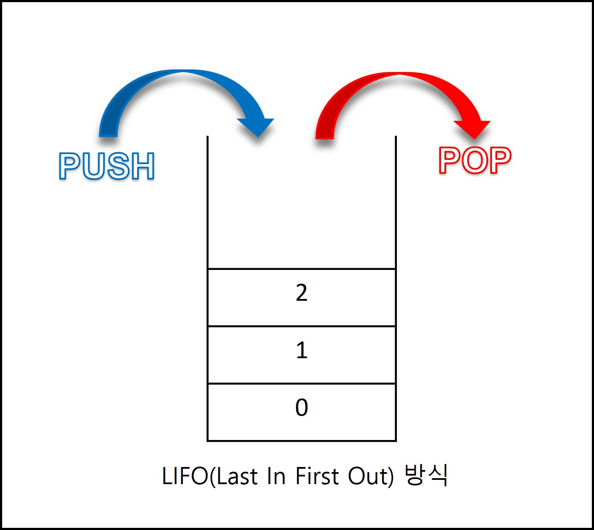
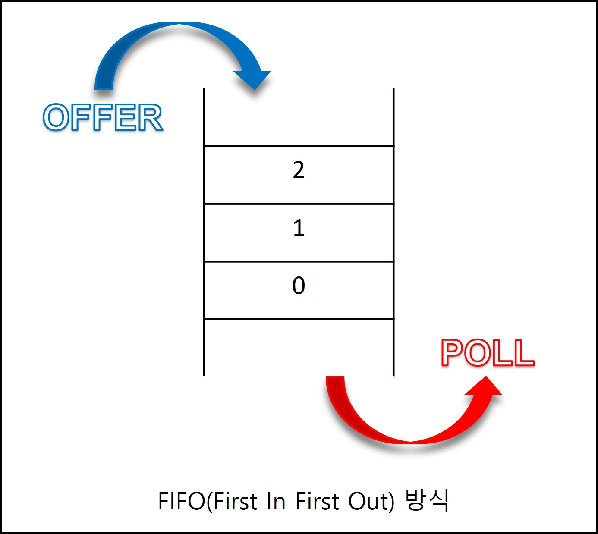

### 자료구조 Stack, Queue

#### Stack
스택은 쌓다, 쌓이다 라는 뜻을 가지고있다.
자료구조에서 스택은 말 그대로 아래에서부터 위로 쌓는 구조라고 생각하면 된다. 맨 마지막에 쌓인 자료를 먼저 가져오는 형태를 띄우고 있다.



### 자바스크립트 에서의 예시
```
const stack = []; 

stack.push(1); // [1]
stack.push(2); // [1, 2]
stack.push(3); // [1, 2, 3]
stack.push(4); // [1, 2, 3, 4]
stack.push(5); // [1, 2, 3, 4, 5]

console.log(stack); // [1, 2, 3, 4, 5]

stack.pop(); // [1, 2, 3, 4]
stack.pop(); // [1, 2, 3]

console.log(stack); // [1, 2, 3]
```


#### Queue
큐는 줄을 서서 기다리다, 대기 행렬 이라는 뜻을 가지고 있다.
자료구조 큐는 스택과 반대되는 개념으로 먼저 들어간  FIFO(First In First Out) 혹은 LILO(Last In Last Out) 을 특징으로 가지고 있습니다. 티켓을 사려고 줄을 서서 기다리는 모습과 흡사한 구조를 가지고 있습니다.



### 자바스크립트 에서의 예시
```
const queue = []; 

queue.push(1); // [1]
queue.push(2); // [1, 2]
queue.push(3); // [1, 2, 3]
queue.push(4); // [1, 2, 3, 4]
queue.push(5); // [1, 2, 3, 4, 5]

console.log(queue); // [1, 2, 3, 4, 5]

queue.shift(); // [2, 3, 4, 5]
queue.shift(); // [3, 4, 5]

console.log(queue); // [3, 4, 5]
```


