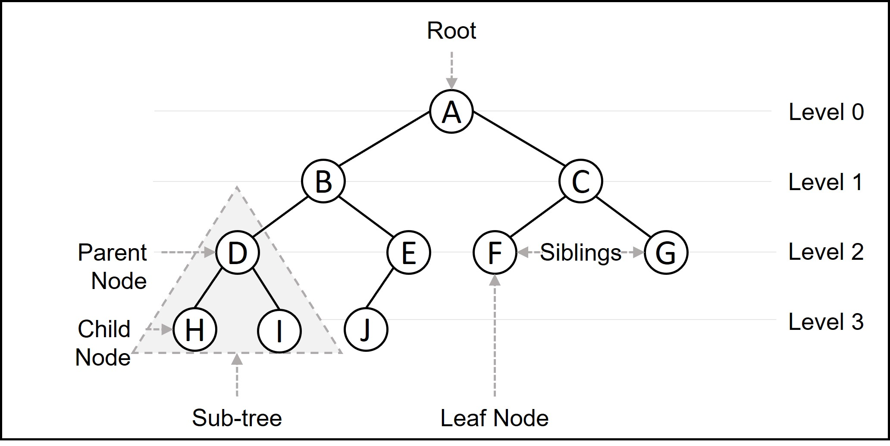

### 트리의 개념

#### 트리는 노드로 이루어진 자료 구조

트리는 하나의 루트 노드를 갖는다.
루트 노드는 0개 이상의 자식 노드를 갖고 있다.
그 자식 노드 또한 0개 이상의 자식 노드를 갖고 있고, 이는 반복적으로 정의된다.
노드(node)들과 노드들을 연결하는 간선(edge)들로 구성되어 있다.
트리에는 사이클(cycle)이 존재할 수 없다.
노드들은 특정 순서로 나열될 수도 있고 그럴 수 없을 수도 있다.
각각의 노드는 부모 노드로의 연결이 있을 수도 있고 없을 수도 있다.
각각의 노드는 어떤 자료형으로도 표현 가능하다.

### 트리의 용어
- 깊이(depth) : 트리 구조에서는 루트로부터 하위 계층의 특정 노드까지의 깊이(depth)를 표현할 수 있습니다.     루트 노드는 지면에 있는 것처럼 깊이가 0입니다. 
위 그림에서 루트 A의 depth는 0이고, B와 C의 깊이는 1입니다. D, E, F, G의 깊이는 2입니다.
- 레벨(Level)
트리 구조에서 같은 깊이를 가지고 있는 노드를 묶어서 레벨(level)로 표현할 수 있습니다. depth가 0인 루트 A의 level은 1입니다. depth가 1인 B와 C의 level은 2입니다. D, E, F, G의 레벨은 3입니다. 같은 레벨에 나란히 있는 노드를 형제 노드(sibling Node) 라고 합니다.
- 높이(Height)
트리 구조에서 리프 노드를 기준으로 루트까지의 높이(height)를 표현할 수 있습니다. 리프 노드와 직간접적으로 연결된 노드의 높이를 표현하며, 부모 노드는 자식 노드의 가장 높은 height 값에 +1한 값을 높이로 가집니다. 트리 구조의 높이를 표현할 때에는 각 리프 노드의 높이를 0으로 놓습니다.위 그림에서 H, I, E, F, J의 높이는 0입니다. D와 G의 높이는 1입니다. B와 C의 높이는 2입니다. 이때 B는 D의 height + 1 을, C는 G의 height + 1 을 높이로 가집니다. 따라서, 루트 A의 높이는 3입니다
- 루트 노드(root node): 부모가 없는 노드, 트리는 하나의 루트 노드만을 가진다.
- 단말 노드(leaf node): 자식이 없는 노드, ‘말단 노드’ 또는 ‘잎 노드’라고도 부른다.
- 내부(internal) 노드: 단말 노드가 아닌 노드
- 간선(edge): 노드를 연결하는 선 (link, branch 라고도 부름)
- 형제(sibling): 같은 부모를 가지는 노드
- 노드의 크기(size): 자신을 포함한 모든 자손 노드의 개수
- 노드의 깊이(depth): 루트에서 어떤 노드에 도달하기 위해 거쳐야 하는 간선의 수
- 노드의 레벨(level): 트리의 특정 깊이를 가지는 노드의 집합
- 노드의 차수(degree): 하위 트리 개수 / 간선 수 (degree) = 각 노드가 지닌 가지의 수
- 트리의 차수(degree of tree): 트리의 최대 차수
- 트리의 높이(height): 루트 노드에서 가장 깊숙히 있는 노드의 깊이

### 트리의 특징

- 그래프의 한 종류이다. ‘최소 연결 트리’ 라고도 불린다.
- 트리는 계층 모델 이다.
- 트리는 DAG(Directed Acyclic Graphs, 방향성이 있는 비순환 그래프)의 한 종류이다.
- loop나 circuit이 없다. 당연히 self-loop도 없다.
- 사이클이 없다.
- 노드가 N개인 트리는 항상 N-1개의 간선(edge)을 가진다.
- 간선은 항상 (정점의 개수 - 1) 만큼을 가진다.
- 루트에서 어떤 노드로 가는 경로는 유일하다.
- 임의의 두 노드 간의 경로도 유일하다. 즉, 두 개의 정점 사이에 반드시 1개의 경로만을 가진다.
- 한 개의 루트 노드만이 존재하며 모든 자식 노드는 한 개의 부모 노드만을 가진다.
- 부모-자식 관계이므로 흐름은 top-bottom 아니면 bottom-top으로 이루어진다.
- 순회는 Pre-order, In-order 아니면 Post-order로 이루어진다. 이 3가지 모두 DFS/BFS 안에 있다.
- 트리는 이진 트리, 이진 탐색 트리, 균형 트리(AVL 트리, red-black 트리), 이진 힙(최대힙, 최소힙) 등이 있다.
