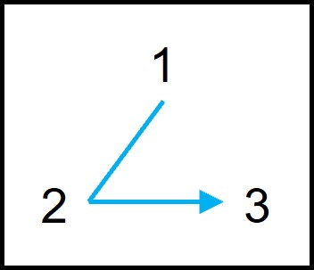

### 이진트리 순회

이진 트리에 있는 모드 노드들을 한번씩 모두 방문하요 노드가 가지고 있는 데이터를 처리하는 것을 순회라고 합니다. 리스트나 스택, 큐와 같은 선형 자료구조는 순회하는 방법이 한 가지였지만, 트리는 계층적인 구조를 가지고 있기 때문에 여러가지 순회 방법이 있습니다. 그리고 각 노드들을 순회할 때는 재귀적으로 반복하게 됩니다.

### 전위 순회
전위 순회는 현재 노드를 방문하는 D작업을 가장 먼저 수행하여 DLR순서로 순회하는 방법입니다. 

1. 현재 노드를 방문한다 = D
2. 현재 노드의 왼쪽 서브 트리로 이동한다 =  L
3. 현재 노드의 오른쪽 서브 트리로 이동한다 = R

#### 결과 ABDECFG

### 중위 순회
중우 순회는 현재 노드를 방문하는 D작업을 L작업과 R작업 중간에 수행하여 LDR순서로 순회하는 방법입니다.

1. 현재 노드n의 왼쪽 서브 트리로 이동한다 : L
2. 현재 노드 n을 방문한다 : D
3. 현재 노드 n의 오른쪽 서브 트리로 이동한다 : R

#### 결과 DBEAFCG

### 후위 순회
후위 순회는 현재 노드를 방문하는 D작업을 가장 나중에 수행하여 LRD의 순서로 순회하는 방법입니다.

1. 현재 노드n의 왼쪽 서브 트리로 이동한다 : L
2. 현재 노드 n의 오른쪽 서브 트리로 이동한다 : R
3. 현재 노드 n을 방문한다 : D

