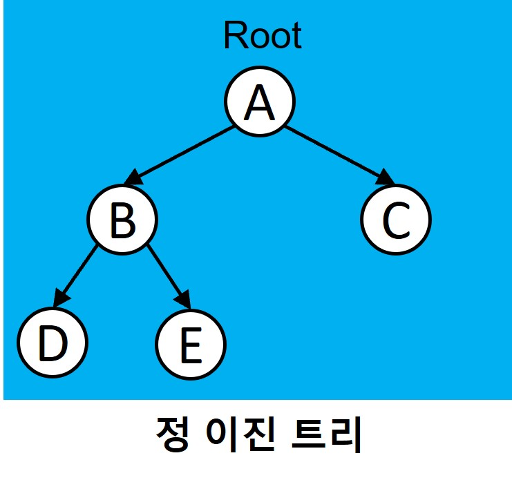
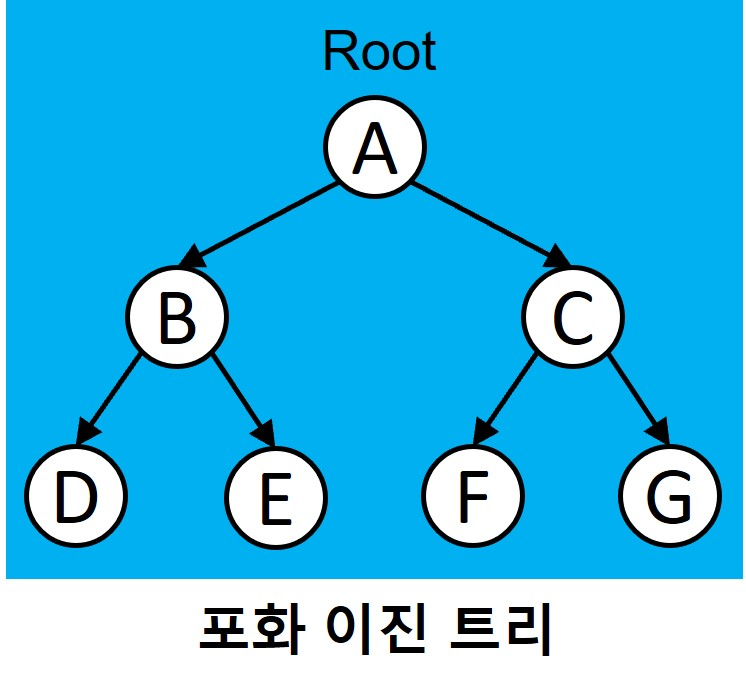
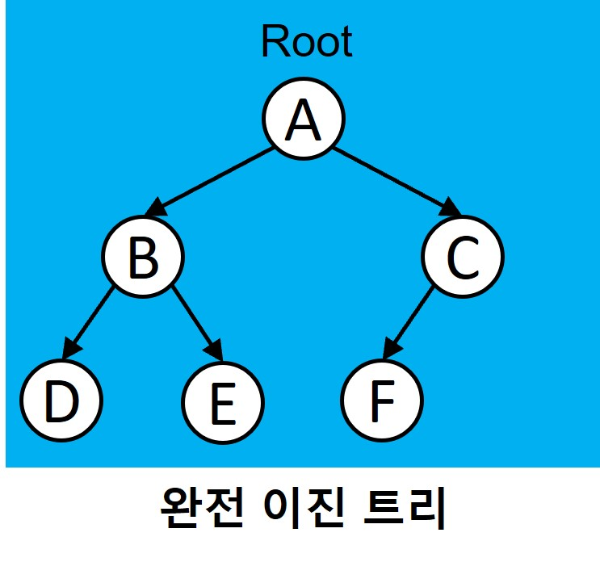

### 정 이진 트리

#### 정 이진트리는 잎새노드를 제외한 모든 노드가 자식 노드를 2개 또는 0개를 가진다.

### 포화 이진 트리
정 이진 트리이면서 완전 이진 트리인 경우입니다. 모든 리프 노드의 레벨이 동일하고, 모든 레벨이 가득 채워져 있는 완벽한 피라미드 구조를 가지고 있습니다.
모든 내부 노드가 두 개의 자식 노드를 가진다. 모든 말단 노드가 동일한 깊이 또는 레벨을 갖는다.

### 완전 이진 트리
완전 이진 트리는 마지막 레벨을 제외한 모든 레벨에서 노드들이 꽉 채워진 이진트리입니다. 그리고 데이터가 왼쪽부터 채워져야 합니다.

