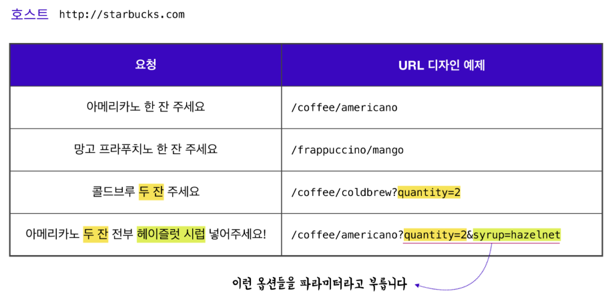
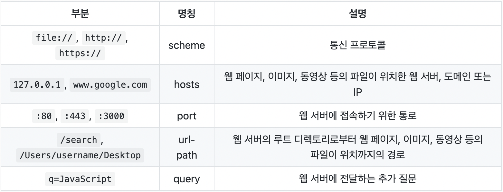
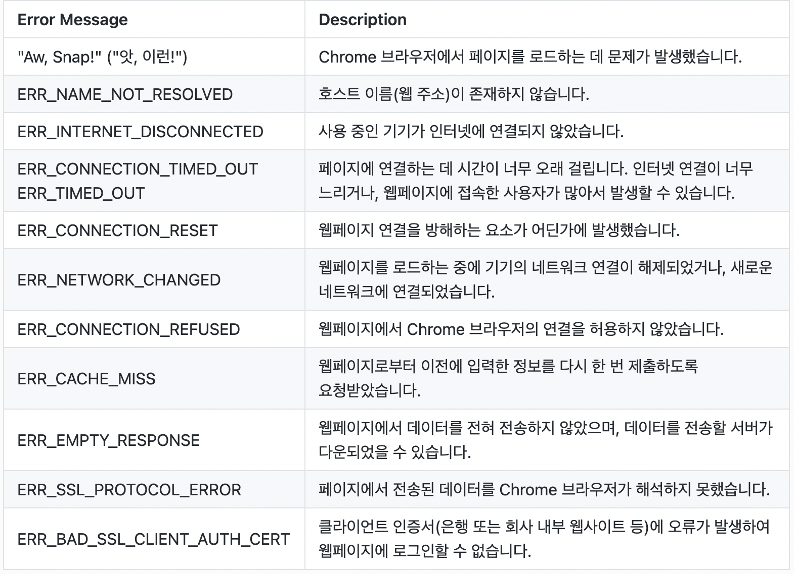
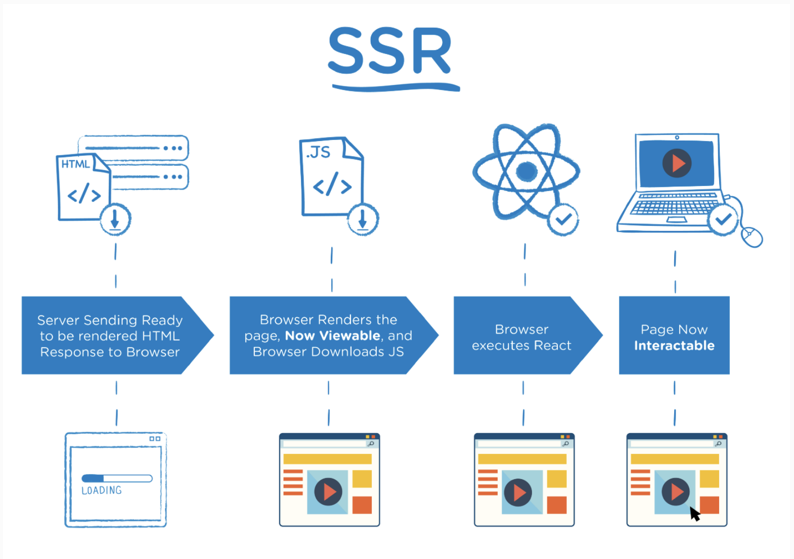
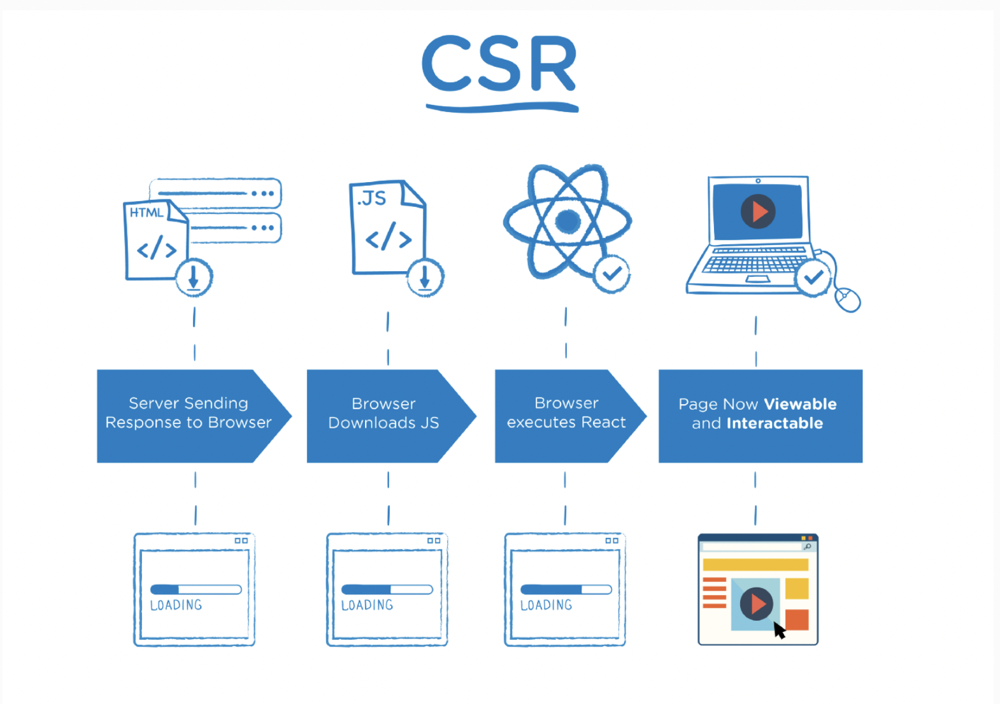
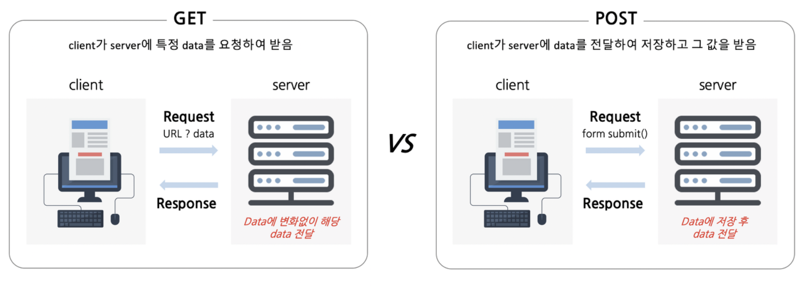

# 프로그래머스 약수의 합
# 문제 설명

정수 n을 입력받아 n의 약수를 모두 더한 값을 리턴하는 함수, solution을 완성해주세요.

<br />

# 제한 사항
n은 0 이상 3000이하인 정수입니다.

<br />

# 입출력 예

|  n  | return |
| :-: | :----: |
| 12  |   28   |
|  5  |   6    |

<br />

# 입출력 예 설명

입출력 예 #1 <br/>
12의 약수는 1, 2, 3, 4, 6, 12입니다. 이를 모두 더하면 28입니다.

입출력 예 #2 <br/>
5의 약수는 1, 5입니다. 이를 모두 더하면 6입니다.

<br />

# 문제 풀이

약수는 자기 자신과 나눴을때 나머지 값이 0이 나오는 특징이 있다. 그래서 어떤 임의 수를 길이만큼 순회해서 자기 자신과   나눴을때 0이 나오는 조건을 세웠고 조건에 부합하면 다 더해주도록 하였습니다.


만약에 8을 넣었을 경우

8 % 1 === 0  통과  1<br />
8 % 2 === 0  통과  2<br />
8 % 3 === 0  통x <br />
8 % 4 === 0  통과  4<br />
8 % 5 === 0  땡x<br />
8 % 6 === 0  땡x<br />
8 % 7 === 0  땡x<br />
8 % 8 === 0  통과  8<br />

그래서 8의 약수의 합은 15가 나옵니다

## Javascript

```js
function solution(n) {
    var answer = 0;
    for(let i = 1; i <= n; i++){
        if(n%i===0){
            answer = answer + i
        }
    }
    return answer;
}
```

# 스프린트 정리

# 네트워크 기초
1. 클라이언트-서버 콘셉트 이해하기!<br />
2. 브라우저의 작동 원리 이해하기!<br />
3. http messages의 구조<br />

## 1. 클라이언트와 서버
기본적으로 클라이언트 서버 아키텍쳐, 다른말로는 2티어 아키텍처라고 부릅니다.<br />
웹브라우저와 같이 서버에 접속하기 위한 사용자를 클라이언트라고 부릅니다.<br />
서버란 서비스를 제공하는 컴퓨터입니다. 페이지 지원이나, 공유 데이터의 처리 및 저장등을 합니다.<br />

### HTTP(Hyper Text Transfer Protocol) 
프로토콜(protocol)은 통신 규약, 즉 클라이언트와 서버 간의 통신 약속입니다.<br />
브라우저와 서버간에 데이터를 주고 받기 위해 사용하고 있습니다.<br />  


### HTTP의 특징
1. client의 요청이 있을 때만 서버가 응답하는 단방향 통신 입니다.<br />
2. 서버가 요구하는 API에 맞게 요청해야 응답을 받을 수 있습니다. <br />
3. stateless(무상태성) 모든 http 요청은 독립적이며 서버는 클라이언트의 상태를 기억하지 못합니다.<br />

### API(Application Programming Interface)
서버는 클라이언트에게 리소스를 잘활용할수 있도록 인터페이스를 제공합니다. 이를 API라고 부르고<br />
클라이언트가 요청을 잘할수 있도록 도와주는 메뉴판이라고 생각하면 됩니다.  
<br />

<br />

## 2. 브라우저의 작동 원리(보이지 않는 곳)

### URL, URI
URL은 자원의 위치를 알려주기 위한 프로토콜입니다 브라우저는 URL을 이용하여 자원의 위치를 찾을수 있습니다. URL은 scheme, hosts,url-path로 구분 할 수 있고 여기서 query,bookmark를 더한 것이 URI입니다. 브라우저의 검색창을 클릭하면 나타나는 주소가 URI이고 URI는 URL을 포함하는 상위 개념입니다.<br/>  


### IP, PORT 
IP는 Internet Protocol의 줄임말로, 인터넷상에서 사용하는 주소체계를 의미합니다.<br />
Port는 IP주소가 가리키는 pc에 접속할수 있는 통로(채널)를 의미힙나다.<br />  

잘알려진 포트번호<br /> 
22 : SSH<br /> 
80 : HTTP<br /> 
443: HTTPS<br /> 

### Domain, DNS 
웹 브라우저를 통해 특정 사이트를 진입 할때, IP 주소를 대신하여 사용하는 주소를 도메인이라고 합니다.<br />
DNS는 Domain Name System의 줄임말로, 호스트의 도메인 이름을 ip주소로 변환하거나 반대의 경우를<br />
수행할 수 있도록 개발된 데이터베이스 시스텝입니다.<br />

### 크롬 브라우저 에러 읽는 법 
크롬 브라우저를 실행 할때 가끔 에러 페이지나 메세지를 본 경험이 있습니다! 이는 웹페이지를 제공하는 서버와 크롬 브라우저가 소통하는 단계에서 해석 할 수 없는 데이터를 전송 받은 경우에 발생합니다.  

다음 에러 메시지가 나타난다면, 페이지를 여는 중에 문제가 발생했다는 뜻입니다.<br />
<br />

<br />

## 2-2. 브라우저의 작동 원리(보이는 곳)

### SSR, CSR


1. SSR은 Server Side Rendering의 줄임말로 SEO가 우선순위 인경우 사용합니다.<br />
2. 웹 페이지의 첫 화면 렌더링이 빠르게 필요할 경우, 단일 파일의 용량이 작은 SSR이 적합합니다.<br />
3. 웹 페이지가 사용자와 상호작용이 적은 경우, SSR을 활용 할 수 있습니다.<br />


1. SEO가 우선순위가 아닌경우, CSR을 이용할 수 있습니다.<br />
2. 사이트에 풍부한 상호 작용이 있는 경우, CSR은 빠른 라우팅으로 강력한 사용자 경험을 제공합니다.<br />
3. 웹 어플리케이션을 제작하는경우, CSR을 이용해 더 나은 사용자 경험을 제공 할수 있습니다(빠른동적렌더링 등)<br />

### SSR, CSR 차이점 <br /> 
CSR과 SSR의 주요 차이점은 페이지가 렌더링되는 위치입니다. SSR은 서버에서 페이지를 렌더링하고, CSR은 브라우저(클라이언트)에서 페이지를 렌더링합니다. 브라우저는 사용자가 다른 경로를 요청할 때마다 페이지를 새로고침 하지 않고, 동적으로 라우팅을 관리합니다.<br />

## 3. http messages의 구조

### HTTP messages
http messages는 클라이언트와 서버 사이에서 데이터가 교환되는 방식이며 요청과 응답 할수 있습니다. 요청(Requests)과 응답(Responses)은 다음과 같은 유사한 구조를 가집니다.<br /> 

1. start line : start line에는 요청이나 응답의 상태를 나타냅니다. 항상 첫 번째 줄에 위치합니다. 응답에서는 status line이라고 부릅니다.<br />
2. HTTP headers : 요청을 지정하거나, 메시지에 포함된 본문을 설명하는 헤더의 집합입니다.<br />
3. empty line : 헤더와 본문을 구분하는 빈 줄이 있습니다.<br />
4. body : 요청과 관련된 데이터나 응답과 관련된 데이터 또는 문서를 포함합니다. 요청과 응답의 유형에 따라 선택적으로 사용합니다.<br />

### HTTP Request Method
http 요청 메서드를 사용해서 URL에 접근하여 서버에 특정 데이터를 요청 할 수 있습니다.

GET : 존재하는 데이터를 요청<br />
POST : 새로운 데이터를 생성<br />
PUT : 존재하는 데이터를 변경 (modify)<br />
PATCH : PUT이랑 같은 개념이지만 교체의 개념이 더 크다(replace)<br />
DELETE : 존재하는 데이터를 삭제<br />

고로 http 요청 메서드는 조회, 생성, 변경, 삭제를 할 수 있습니다.<br />


### HTTP Status Code
http 상태 코드는 클라이언트의 요청에 의해 서버가 응답해주는 정보입니다. 주요 상태 코드는 100~500번대 까지 각각 다른 의미로 다양하게 있습니다.

#### 1xx 처리중에 있습니다

#### 2xx 성공 : 
200번대의 상태 코드는 대부분 성공을 의미합니다.
#### 3xx 리디렉션 : 
300번대의 상태 코드는 대부분 클라이언트가 이전 주소로 데이터를 요청하여 서버에서 새 url로 리디렉트를 유도하는 경우입니다.
#### 4xx 클라이언트 요청오류 : 
400번대의 상태 코드는 대부분 클라이언트의 코드가 잘못된 경우입니다. 유효하지 않은 정보를 요청했거나 권한이 잘못 되었을 경우 발생합니다.
#### 5xx 서버 에러 : 
500번대 상태 코드는 서버 쪽에서 오류가 난 경우입니다. 