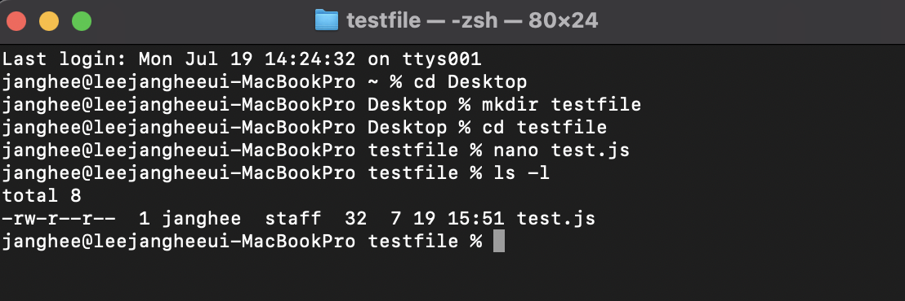
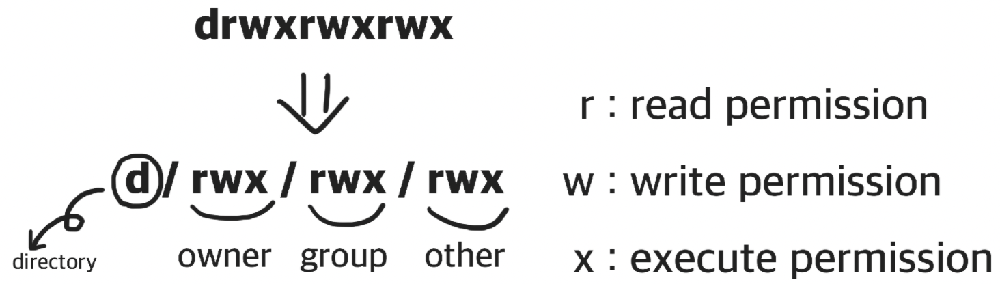

# Linux_사용권한과_환경변수 #1

---

## 사용권한에 대해 알아 볼 것

1. 폴더와 파일의 권한으로 폴더인지 구별하는 방법
2. 폴더나 파일의 사용권한 변경 방법

---

## 폴더인지 파일인지 구별하는 방법

터미널창에 `mkdir`과 `nano`를 활용해서 아래와 같이 진행하고 `ls -l`를 입력하면 폴더인지 파일인지 구별할수 있습니다. `-`시작은 not directory로 파일을 의미합니다. `d`시작은 directory로 폴더를 의미합니다.

```js
// testfile 폴더를 생성하고 test.js파일을 생성
mkdir testfile
nano test.js
```

실행되면 입력창에 console.log('아무거나') 작성하고 `ctr1 + x,y,Enter` 순서대로 입력하면, 새로운 파일을 저장할수 있습니다. 저장 후 터미널 창에 `ls -l` 입력하면 아래와 같이 출력됩니다. 

<br />



<br />

`-rw-r--r--` 출력에서 `-`로 시작 되었기 때문에 test.js는 파일임을 확인 할 수 있습니다. 그렇다면 rwe 이런 기호는 무엇을 의미할까요 ?
<br />



<br />

정리하자면 아래와 같습니다.  

1. r은 read permission 읽기 권한을 뜻합니다.
2. w는 write permission 쓰기 권한을 뜻합니다.
3. x는 execute permission 실행 권한을 뜻합니다.

그렇다면 아까 출력한 `-rw-r--r--`를 해석하면 **소유자는 읽기 쓰기가 가능하고 나머지 그룹은 읽기만 가능하다**라는 뜻입니다.

### 용어정리 User, Group, Other

Access class         |의미
:------------------:|:------------------:
  user  | 파일의 소유자입니다.(파일을 만든 사람)
  group | 여러 유저가 포함 그룹에 속한 모든 유저는 파일에 대한 동일한 그룹 엑세스 권한을 갖습니다.
  other | 파일을 만들지 않은 다른 모든 유저를 의미합니다.


## chmod : 권한을 변경하는 명령어

명령어 `chmod`는 파일이나 폴더의 읽기,쓰기,실행 권한을 변경할수 있습니다.(폴더나 파일의 소유자가 같을 경우만, 같지 않을 경우 `sudo`를 이용) `chmod`를 통해 권한을 변경하는 방식은 두가지가 있습니다.


### Symbolic method

Symbolic method방법은 +,-,0으로 엑세서 유형을 표기해서 변경합니다.

Access class         |Operator|Access Type
:------------------:|:------------------:|:----------------:
u(user) |+(add access)   |r(read)
g(group)|-(remove access)|w(write)
o(other)|=(set exact access)|x(execute)
a(all:u,g, and o)||

### Symbolic method 사용 예시

```js
chmod a=rw test.js //# -rw-rw-rw-
chmod u= test.js //# ----rw-rw-
chmod a+rx test.js //# -r-xrwxrwx
chmod go-wx test.js //# -r-xr--r--
chmod a= test.js //# ----------
chmod u+rwx test.js //# -rwx------
```

### Absolute form

Absolute form방법은 숫자7까지 나타내는 3bits의 합으로 표기하는 방법입니다.
<br />

Permission | Number
:-------:|:-------:
Read(r)  |  4
Write(w) |  2
Execute(x) | 1

<br />

Absolute form에서 사용하는 숫자 표입니다. 외우는것보단 참고용으로 쓰는게 좋습니다.
<br />

Num| Sum | rws | Permission
:----:|:----:|:----:|:----:
7	| 4(r) + 2(w) + 1(x) |	rwx	| read, write and execute
6	| 4(r) + 2(w) + 0(-) |	rw-	| read and write
5	| 4(r) + 0(-) + 1(x) |	r-x	| read and execute
4	| 4(r) + 0(-) + 0(-) |	r--	| read only
3	| 0(-) + 2(w) + 1(x) |	-wx	| write and execute
2	| 0(-) + 2(w) + 0(-) |	-w-	| write only
1	| 0(-) + 0(-) + 1(x) |	--x	| execute only
0	| 0(-) + 0(-) + 0(-) |	---	| none

### Absolute form 사용 예시

```js
//# u=rwx (4 + 2 + 1 = 7), go=r (4 + 0 + 0 = 4)
chmod 744 test.js //# -rwxr--r--
```

---

## 최종 정리

### 사용권한

폴더와 파일인지 구분하기 위해서 터미널에 `ls -l` 입력하여 `-`로 시작하면 파일, `d`로 시작하면 폴더입니다.<br />
폴더나 파일의 사용권한을 변경하기 위해선 `chmod`키워드 뒤에 **Symbolic method** 방법 이나 **Absolute form** 방법으로 표기하면 됩니다. Symbolic method방법은 +,-,= 으로 표기하고 Absolute form는 rwx를 3bit으로 해석하여 숫자 3자리로 권한을 표기합니다.

---

# Linux_사용권한과_환경변수 #2

---

## 환경변수에 대해 알아 볼 것

1. PC에 저장하는 환경변수가 무엇인지 어떻게 사용하는지
2. export, dotenv, .env에 대해 알아보기

---

## export

터미널에 명령어 export를 입력하면 기록된 환경 변수를 확인 할 수 있습니다. 변수를 설정할때는 등호 표시 앞뒤에는 반드시 공백이 없어야 합니다. (export는 많이 안씁니다. 간단하게 조회할때 사용)


## dotenv: 자바스크립트에서 환경변수 사용하기

dotenv쓰기 앞서 왜 쓰는지 이유를 알아야 합니다. 어떠한 규모있는 프로잭트를 진행 할때 API Key, 포트와 같이 공개할 수 없는 정보가 코드에 포함될 경우, 네트워크를 통해 API KEY가 노출될 경우가 있습니다. 깃 허브도 마찬가지 입니다. 그래서 이러한 중요한 정보 노출을 방지하고 보안을 위해 환경변수를 사용합니다.

```js
// dotenv 사용
npm init     // 엔터쳐서 설정 완료
npm i dotenv // 모듈설치
```

모듈을 설치하고 간단하게 index.js생성하고 `console.log(process.env)`를 입력하면 export로 확인한 내용과 동일한 내용을 객체로 출력합니다. 여기서 중요한 포인트는 `precess.env`는 노드 환경에서 조회가 가능하고 .env파일을 환경변수로 사용할 수 있게 도와줍니다. 

## .env: Node.js에서 환경변수 영구 적용

환경변수를 사용하는 방법은 간단합니다. 우선 .env파일을 생성하고 환경변수를 입력한 뒤 저장합니다.

```js
//환경변수 설정
nano .env  // 환경변수 설정하기
cat .env   // 환경변수 출력
```

CUI가 불편하면 그냥 .env파일을 만들어서 진행해도 상관 없습니다.

```js
//.env 파일
APIKEY = MY_API_KEY
```

.env파일에서 숨기고 싶은 정보를 변수로 담아서 저장합니다.

```js
//index.js
const dotenv = require('dotenv')
dotenv.config();
console.log(process.env.APIKEY)
```

위와 같이 dotenv모듈을 불러와서 .env파일과 같이 환경변수를 관리할수 있습니다.

```js
//터미널
node index.js // MY_API_KEY
```

아래 링크는 .env파일을 활용한 API 숨기기 예시입니다! 어떤식으로 사용하는 참고하면 좋을것 같습니다.<br />

[.env파일을 활용한 API키 숨기기](https://github.com/leejanghe/Today-I-Learned/blob/master/ReactStudy/api_%ED%82%A4_%EC%88%A8%EA%B8%B0%EA%B8%B0.md)

---

## 최종 정리

### 환경변수

환경변수는 개발자 개인의 API키나 기업용 API키 등 중요한 정보를 보호하기위한 변수입니다. 환경 변수를 활용하는 키워드는 export, dotenv, .env가 있습니다. export는 간단하게 환경변수를 조회할때 사용하고 dotenv는 자바스크립트 환경에서 사용하는 모듈로서 .env파일과 함께 환경 변수를 관리합니다.