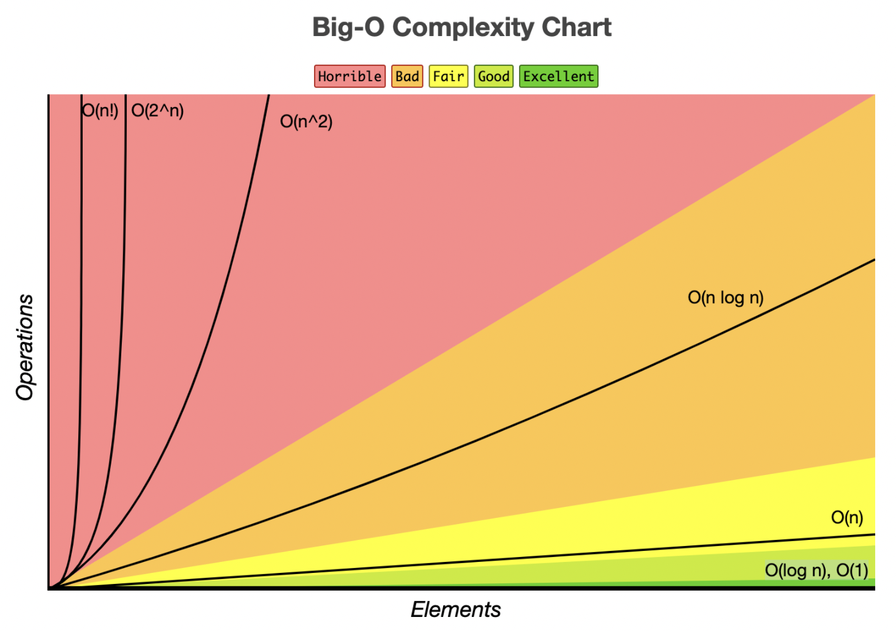

## Time Complexity (시간복잡도)

시간 복잡도는 입력값이 커짐에 따라 증가하는 시간의 비율을 최소화한 알고리즘을 말하며 주로 Big-O(빅-오)표기법을 사용합니다. 

1. 문제를 해결하는데 걸리는 시간과 입력한 함수 관계로, 연산의 횟수를 센다.
2. 상대적으로 불필요한 연산을 제거하여 알고리즘의 분석을 조금 더 간편하게 하는 목적

<br />

## Big-O를 많이 쓰는 이유

빅오 뿐만 아니라 빅오메가, 빅세타 이렇게 3가지 표기법은 시간 복잡도를 최악, 최선, 평균의 경우에 대해 나타내는 방법입니다. 이중 빅오를 많이 사용합니다. 그이유는 빅오는 최선의 시간 뿐만 아니라 최악의 경우도 고려합니다. 그래서 극단적으로 최악의 경우가 발생하지 않기 위해 최악의 경우도 고려하여 대비 할수 있기 때문입니다.

<br />

### 알고리즘 성능 평가

1. 최선의 경우(Best Case) 
- 최적의 입력을 한 상태에서 작업을 완료하는데 가장 빠른 시간이 걸리는 것

2. 최안의 경우(Worst Case)
- 최악의 입력을 한 상태에서 작업완료까지 가장 느린 시간

3. 평균의 경우(Average Case)
- 여러가지 다른 경우의 수를 입력하여, 총실행시간을 계산하고 시행횟수로 나눈다.

<br />

### 시간복잡도 그래프



---

## O(1)

입력 데이터의 크기와 상관없이 언제나 일정한 시간이 걸리는 알고리즘 입니다. 문제를 해결하는데 오직 한 단계만 거칩니다. (ex : 배열에서 특정 인덱스 찾기, 해시테이블 찾기)

```js
//O(1) 예시 코드
function O_1(arr, index){
    return arr[index]
}

let arr = [1,2,3,4,5];
index = 1;
let result = O_1(arr, index);

console.log(result) // 2
```

위 알고리즘은 입력값의 크기가 커져도 즉시 출력값을 얻어 낼수 있습니다.

<br />

## O(n)

입력 데이터의 크기에 비례해서 처리시간에 걸리는 알고리즘을 표현할때 사용합니다. 크기가 N일 경우 N번 만큼의 수행시간을 가집니다(linear time) (예시 : linear seact, for문을 통한 탐색, 연결리스트 순회, 최대값찾기)

```js
//O(n) 예시 코드 #1
function O_N(arr, index){
    return arr[index]
}

let arr = [1,2,3,4,5];
for(let i =0; i<arr.length; i++)
let result = O_N(arr, i);

console.log(result) // 2

//O(n) 예시 코드 #2
function ON1(n){
    for(let i =0; i<n; i++)
    // do something
}

function ON2(n){
    for(let i =0; i<2n; i++)
    // do something
}

```

위 알고리즘은 n앞에 있는 계수가 생략되었다고 생각하면 됩니다.

<br />

## O(log n)

초반엔 빠르지만 후반부로 갈수록 시간이 증가합니다. O(1)다음으로 빠른 시간 복잡도를 가지고 시간에 비례하여, 탐색 가능한 데이터 양이 2의 n승이 됩니다. 만약 입력 자료의 수에 따라 실행 시간이 이 log N의 관계를 만족한다면 N이 증가함에 따라 실행시간이 조금씩 늘어 납니다. 주로 커다란 문제를 일정한 크기를 갖는 작은 문제로 쪼갤떄 사용하는 유형입니다 (예시:이진 탐색)

```js
//O(log n) 예시 코드
let i = n
while(parseInt(i)>0){
    i = i / 2;
}
```

N이 주어졌을 때 계속해서 1/2씩 줄어들기 때문에 연산 횟수는 log2(n)이고 Big-O표기법으로 나타내면 O(log n)입니다. 이 알고리즘은 예를 들어 1~100숫자 중 원하는 숫자를 맞출때 몇번만에 찾을수 있을지 최선을 수와 최악의 수 둘다 구할수 있습니다. 대표적으로 이진탐색할때 자주 사용합니다.

<br />

## O(n⌃2)

주로 2중 for loop를 사용하여 조합가능한 모든 쌍을 대상으로 하는 경우가 많습니다. 데이터양에 따라 시간은 제곱에 비례합니다(효율이 좋지 않음, 사용거의 안함) (예시:버블정렬, 삽입정렬)

```js
function a(n){
    for(let i=0; i <n; i++){
        for(let j=0; j<n; j++){
            //do somethiong
        }
    }
}

function a_1(n){
    for(let i=0; i <n; i++){
        for(let j=0; j<n; j++){
            for(let k=0; k<n; k++){
             //do somethiong
            }
        }
    }
}
```

<br />

## O(2⌃n)

지수형 빅오, 연산횟수 증가를 야기하며 Big-O표기법 중 가능 느린 시간 복잡도를 가집니다. (예시:피보나치수열)

```js
function fibo(n){
    if(n <= 1){
        return 1
    }
    return fibo(n-1) + fibo(n-2);
}

---

## Greedy Algorithm (탐욕알고리즘)

탐욕 알고리즘은 선택의 순간마다 최적의 상황만을 쫓아 최종적인 해답에 도달하는 방법입니다.

<br />

### 탐욕 알고리즘 해결 단계

1. 선택 절차(Selection Procedure) 
- 현재상태에서 최적의 해답을 선택합니다.

2. 적절성 검사(Feasibility Check)
- 선택된 해가 문제의 조건을 만족하는지 검사합니다.

3. 해답 검사(solution Check)
- 원래의 문제가 해결되었는지 검사하고, 해결되지 않았다면 선택 절차로 돌아가 위의 과정을 반복합니다.

---

## (Greedy)짐나르기 코드 리뷰

1. 선택 절차
- 가장 무거운 짐과 가장 가벼운 짐을 선택

2. 적절성 검사
- 선택한 짐들의 무게합이 limit을 초과하는지 확인, 초과하지 않으면 **둘이** 묶어서 한박스에 넣고 다시 1과정으로 돌아간다 초과한다면 다른 무거운 짐을 선택한다.

3. 해답 검사
- 위 과정을 반복 후 묶인 조합에서 stuff의 길이 만큽 조합의 수를 빼준다.

<br />

```js
// 손코딩
(문제 조건은 최대 두개 묶을 수 있음) => 이뜻은 묶은 수에서 stuff의 길이만 큼 빼면 답을 구할수 있음
만약에 stuff에 [50, 50, 70, 80] 가 있고 제한수는 100 일 경우

제일작은   제일큰        합
 50   +   80     =   130  // 제한 초과 x => 그다음 무거운 짐으로
 50   +   70     =   120  // 제한 초과 x => 그다음 무거운 짐으로
 50   +   50     =   100  // 해당 조건 성립

 묶어서 한박스는 총 1회 stuff의 길이 4에서 1을 뺀 총 3번 만에 나를 수 있습니다.
 ```

 이를 코드로 표현하자면

 ```js
function movingStuff(stuff, limit){
    let count = 0   //최대 2개를 묶을 수있는 횟수
    let sort = stuff.sort((a,b)=>a-b) // sort를 활용해서 효율적으로 무게 비교

    let largeIdx = sort.length-1  // 가장 무거운 짐
    let smallIdx = 0 // 가장 가벼운 짐

    while(largeIdx > smallIdx){
        if(sort[smallIdx]+sort[largeIdx] <= limit){ //가장작은것 + 가장무거운 <= 제한 사항을 확인
            //만약에 해당 조건이 부합할 경우 묶음 카운터 +1, 작은거 +1 무거운거 -1
            count++
            smallIdx++
            largeIdx--
        }else{
            //아닐 경우는 그 다음으로 무거운 짐을 선택
            largeIdx--
        }
    }
    // stuff의 길이에서 묶은 카운팅 만큼 빼면 횟수를 구할수 있다.
    return stuff.length - count
}
```

<br />

## (Greedy)편의점 알바 코드 리뷰

1. 선택 절차
- 거스름돈을 최소한으로 주기위해 가장 큰 동전을 선택

2. 적절성 검사
- 고객이 준 돈에서 가장 값이 큰 동전의 값을 나누고 나눌수 없는 잔돈은 그다음으로 큰 동전으로 값을 나눠 준다.

3. 해답 검사
- 위 과정을 반복 후 각각 거슬러 준 동전의 수를 더한다.

<br />

```js
//손코딩 
[500,100,50,10,5,1] //동전
만약에 k값이 4972 일때 거스름돈을 최소한으로 주기 위해선 500 으로 최대한 나눠야 한다.

4972  500원 // 4500  9개
472   100원 // 400   4개
72    50원  // 50    1개 
22    10원   //20    2개
       5월
2      1원   //  2    2개     총 18개
```

이를 코드로 표현하면

```js
function partTimeJob(k) {
  
  let K = 0; // 거스름 돈의 최소값

  let coin = [500,100,50,10,5,1]
  
  for(let el in coin){  
    if(k > 0){
      // 거스롬돈 갯수를 구해 K에 저장
      K += Math.floor(k / coin[el])

      // 그다음 조건
      k = k%(coin[el])
    }
  }
return K
}
```