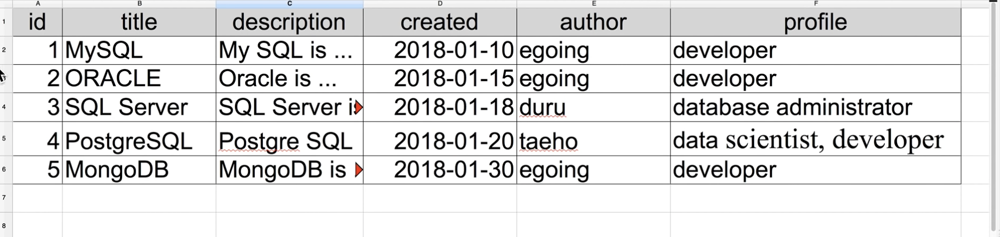

# TIL 2021 - 07 - 17-18 📖 !

주말에는 MySQL 이라는 데이터베이스 메니먼트 시스템 database management system, DBMS
이란걸 공부해 보았습니다 방대한 양의 데이터를 효율적으로 관리 할 수 있는 것 인데요 우선 Oracle에 가입을 하고 MySQL에 가서 다운을 받은 다음에 사용하시면 됩니다 ! 


```
lee-geonwoo@igeon-uui-MacBookPro ~ % cd /usr/local/mysql/bin/
```
이렇게 입력을 하셔서 Mysql이 있는 폴더로 들어가시고 

```
lee-geonwoo@igeon-uui-MacBookPro bin % ./mysql -uroot -p
Enter password:
Welcome to the MySQL monitor.  Commands end with ; or \g.
Your MySQL connection id is 10
Server version: 8.0.25 MySQL Community Server - GPL

Copyright (c) 2000, 2021, Oracle and/or its affiliates.

Oracle is a registered trademark of Oracle Corporation and/or its
affiliates. Other names may be trademarks of their respective
owners.

Type 'help;' or '\h' for help. Type '\c' to clear the current input statement.
```
명령어를 저렇게 입력을 해주면 비밀번호를 치는곳이 나오는데 처음에 MySQL을 다운로드 받으셨을 때 설정해두었던 비밀번호나 설정해두시지 않은경우에는 비밀번호 설정 하라고 나오니 그때 비밀번호를 잘 설정해 주시고 꼭 기억하고 있으셔야 합니다 

다음은 -uroot 라는게 무슨말인가 싶으시겠지만 -u 는 유져 라는 뜻이고 root는 유져의 이름입니다 보통 root는 데이터베이스를 관리하는 최고 관리자라 root로 작업 할 때에는 모든 권한이 있어 작업을 할 때에는 조심 하셔야 합니다 !

자 다음으로는 데이터베이스를 만들어보겠습니다 .

위의 과정을 진행하시거 나면 mysql> 이런식으로 나오면 잘 작동을 하고 있는것 입니다 . 

그 상태에서 아래의 명령어를 입혁해줍니다 ; 세미콜론은 이 명령어가 끝났다는 의미고 MySQL 에서는 명령어가 끝이나면 ; 를 꼭 붙혀주셔야합니다 

```
mysql> CREATE DATABASE opentutorials;
```
이렇게 명령어를 입혁 했을때 
```
Query OK, 1 row affected (0.00 sec)
```
이런 메세지가 나온다면 데이터베이스를 만드는데 성공 한것 입니다 ! 

잘 만들었는지 확인하려면 
```
mysql> SHOW DATABASES;
```
이렇게 입력해보시면 
```
+--------------------+
| Database           |
+--------------------+
| information_schema |
| mysql              |
| opentutorials      |
| performance_schema |
| sys                |
+--------------------+
5 rows in set (0.01 sec)
```
이런 메세지를 볼 수 있는데 지금 내가 만든 데이터베이스를 출력해주는 것입니다 ! 

이제는 테이블을 만들어 줄건데요 ! 테이블을 만들어 주기 위해선 opentutorials 라는 데이터베이스를 사용 해야겠죠 ! 저희가 연습할 데이터베이스라 사용하는 것 입니다 !
```
mysql> USE opemtutorials;
Database changed
```
위와같이 입력을 해주시면 아래와 같이 Darabase changed라는 완료 문구가 나옵니다 저 문구가 나온다면 성공적으로 opentutorials 라는 저희가 만들어놓은 데이터베이스를 사용 할 수 있습니다 

다음으로는 데이터베이스 안의 테이블을 만들어 놓을 것입니다 ! 

만드는 방법으로는 
```
CREATE TABLE 만들고싶은 테이블 이름 
```
이런식으로 만들면 되고 저는 topic 이라는테이블을 만들어 보겠습니다 
 
 이렇게 만들어 줄겁니다 . 


설명용
 ```
 mysql> CREATE TABLE topic(
    -> id INT(11) NOT NULL AUTO_INCREMENT, 

    //INT는 숫자 NOT NULL은 NULL을 허용하지 않음 AUTO_INCREMENT는 테이터가 추가 될 때마다 1씩 자동으로 증가 

    -> title VARCHAR(100) NOT NULL,

    //문자열 제한은 100글자로 NOT NULL은 NULL을 허용하지 않음 

    -> description TEXT NULL,

    //TEXT 를 받고 NULL 허용 

    -> created DATETIME NOT NULL,

    //DATE 는 날짜만 TIME 은 시간만  DATETIME 은 시간 + 날짜
     NOT //NULL은 NULL을 허용하지 않음 

    -> author VARCHAR(30) NULL,

    //VARCHAR는 베리어블 캐릭터의 //약자로 문자열을 받겠다는 의미 제한은 30글자 
    //NULL  허용

    -> profile VARCHAR(100) NULL,

    //100글자 받고 NULL 허용 
    -> PRIMARY KEY(id));

    //메인 Key값으로는 AUTO_INCREMENT로 1씩증가하게 해서 곂칠 일이 없는 ID로 설정 
Query OK, 0 rows affected, 1 warning (0.01 sec)
```

설명 없는 버전
```
mysql> CREATE TABLE topic(
    -> id INT(11) NOT NULL AUTO_INCREMENT,
    -> title VARCHAR(100) NOT NULL,
    -> description TEXT NULL,
    -> created DATETIME NOT NULL,
    -> author VARCHAR(30) NULL,
    -> profile VARCHAR(100) NULL,
    -> PRIMARY KEY(id));
Query OK, 0 rows affected, 1 warning (0.01 sec)
```

이렇게 행과 열을 만들어 줄 수 있고 
이렇게만 만들어주면 아무런 데이터가 없으니 
```
mysql> SHOW TABLES;
+-------------------------+
| Tables_in_opemtutorials |
+-------------------------+
| topic                   |
+-------------------------+
1 row in set (0.01 sec)
```

```
SHOW TABLES;
```
를 입력 하더라도 이렇게만 나옵니다 
더 명확하게 보고싶다면 
```
DESC topic;
```
을 입력하면 

```
mysql> DESC topic
    -> ;
+-------------+--------------+------+-----+---------+----------------+
| Field       | Type         | Null | Key | Default | Extra          |
+-------------+--------------+------+-----+---------+----------------+
| id          | int          | NO   | PRI | NULL    | auto_increment |
| title       | varchar(100) | NO   |     | NULL    |                |
| description | text         | YES  |     | NULL    |                |
| created     | datetime     | NO   |     | NULL    |                |
| author      | varchar(30)  | YES  |     | NULL    |                |
| profile     | varchar(100) | YES  |     | NULL    |                |
+-------------+--------------+------+-----+---------+----------------+
```
이렇게 되어있는 저의 테이블을 볼 수 있습니다 .

이제 데이터를 넣어 줄 건데요 
```
INSERT INTO 테이블 이름
```
을 해줌으로써 테이블에 데이터를 넣어줄 수 있습니다 

```
mysql> INSERT INTO topic (
title, description, created, author, profile) 
VALUES('MySQL', 'MySQL is ...', NOW(),' egoing','developer');
Query OK, 1 row affected (0.01 sec)
```
이렇게 넣어주었고 id를 넣지 않은건 어짜피 저희가 AUTO_INCRESE를 해주었기 떄문에 자동적으로 생깁니다 

앞에 괄호에는 데이터 넣을 곳을 넣어주고 저 순서에 맞게 맞는 데이터를 넣어 주면 됩니다 

다른예시 
``` 
mysql> INSERT INTO topic (title, description, created, author, profile) VALUES('ORACLE', 'ORACLE is ...', NOW(),' egoing','developer');
Query OK, 1 row affected (0.00 sec)
```
이렇게 만들어 준뒤에 저희가 만들어놓은 테이븛을 보는 방법은 

```
SELECT 범위 FROM 테이블 이름
```
으로 볼 수 있습니다 
```
mysql> SELECT * FROM topic;
```
제가 이렇게 입력을 해주면 
```
+----+--------+---------------+---------------------+---------+-----------+
| id | title  | description   | created             | author  | profile   |
+----+--------+---------------+---------------------+---------+-----------+
|  1 | MySQL  | MySQL is ...  | 2021-07-18 17:59:06 |  egoing | developer |
|  2 | ORACLE | ORACLE is ... | 2021-07-18 18:01:14 |  egoing | developer |
+----+--------+---------------+---------------------+---------+-----------+
```
방금 제가 넣어준 데이터 들이 잘 들어가 있는것을 확인 할 수 있고 나머지 데이터를 넣어 주어서 
```
mysql> SELECT * FROM topic;
+----+------------+-------------------+---------------------+---------+---------------------------+
| id | title      | description       | created             | author  | profile                   |
+----+------------+-------------------+---------------------+---------+---------------------------+
|  1 | MySQL      | MySQL is ...      | 2021-07-18 17:59:06 |  egoing | developer                 |
|  2 | ORACLE     | ORACLE is ...     | 2021-07-18 18:01:14 |  egoing | developer                 |
|  3 | SQL Server | SQL server is ... | 2021-07-18 18:02:50 |  duru   | data administrator        |
|  4 | PostgreSQL | PostgreSQL is ... | 2021-07-18 18:04:10 | taeho   | data scientist, developer |
|  5 | MongoDB    | MongoDB is ...    | 2021-07-18 18:05:07 | egoing  |  developer                |
+----+------------+-------------------+---------------------+---------+---------------------------+
5 rows in set (0.00 sec)
```
이렇게 만들어 주었습니다 

* 표시는 전체 라는 뜻 입니다 all

또한 내가 보고싶은 녀석들만 지정해서 SELECT 해올 수 도 있는데요 그럴 경우에는 저 * 표시 대신에 내가 보고 싶은 정보의 값만 넣어서 실행하시면 
```
mysql> SELECT id, title, created, author FROM topic;
+----+------------+---------------------+---------+
| id | title      | created             | author  |
+----+------------+---------------------+---------+
|  1 | MySQL      | 2021-07-18 17:59:06 |  egoing |
|  2 | ORACLE     | 2021-07-18 18:01:14 |  egoing |
|  3 | SQL Server | 2021-07-18 18:02:50 |  duru   |
|  4 | PostgreSQL | 2021-07-18 18:04:10 | taeho   |
|  5 | MongoDB    | 2021-07-18 18:05:07 | egoing  |
+----+------------+---------------------+---------+
5 rows in set (0.00 sec)
```
이렇게 id, title, created, author 의 데이터만 가져오는것을 볼 수 있습니다 

다음은 저 상태에서 author의 값이 egoing 인것 만 보고싶다고 하면 
```
WHERE 조건
```

WHERE문을 사용하면 됩니다 
```
mysql>  SELECT id, title, created, author FROM topic WHERE author='egoing';
+----+---------+---------------------+--------+
| id | title   | created             | author |
+----+---------+---------------------+--------+
|  5 | MongoDB | 2021-07-18 18:05:07 | egoing |
+----+---------+---------------------+--------+
1 row in set (0.00 sec)
```
저는 이렇게 author가 egoing인것만 찾아내었고 띄어쓰기 마저 판별하기 때문에 유의 해야합니다 그래서 제가 앞에 띄어쓰기를 넣은 녀석들은 또 다시 찾아보면 

```
mysql>  SELECT id, title, created, author FROM topic WHERE author=' egoing';
+----+--------+---------------------+---------+
| id | title  | created             | author  |
+----+--------+---------------------+---------+
|  1 | MySQL  | 2021-07-18 17:59:06 |  egoing |
|  2 | ORACLE | 2021-07-18 18:01:14 |  egoing |
+----+--------+---------------------+---------+
```
이렇게 찾아내었습니다 띄어쓰기에 주의 하셔야 저같은 일이 없습니다 ㅠ_ㅠ

다음으로는 id값에 따른 정렬입니다 

방금 뽑아온 저 데이터에서 
```
mysql>  SELECT id, title, created, author FROM topic WHERE author=' egoing' ORDER BY id DESC;
+----+--------+---------------------+---------+
| id | title  | created             | author  |
+----+--------+---------------------+---------+
|  2 | ORACLE | 2021-07-18 18:01:14 |  egoing |
|  1 | MySQL  | 2021-07-18 17:59:06 |  egoing |
+----+--------+---------------------+---------+
2 rows in set (0.00 sec)
```
이렇게 값을 입력을 해주면 id값이 큰것부터 위로 올라가있는것을 볼 수 있습니다
```
ORDER BY
```
라는 걸 사용하고 그 뒤에 내가 넣고 싶은 조건을 넣어주면 됩니다 DESC는 큰것 부터 라는 뜻입니다 

또한 뒤에 LIMIT을 붙히면 내가 원하는 만큼만의 데이터를 가져옵니다
너무나 많은 데이터를 한번에 가져 오면 컴퓨터가 멈추거나 시간이 정말 오래 걸릴 수 도 있으니 해주는 것 입니다
```
mysql>  SELECT id, title, created, author FROM topic WHERE author=' egoing' ORDER BY id DESC LIMIT 1;
+----+--------+---------------------+---------+
| id | title  | created             | author  |
+----+--------+---------------------+---------+
|  2 | ORACLE | 2021-07-18 18:01:14 |  egoing |
+----+--------+---------------------+---------+
1 row in set (0.00 sec)
```
이렇게 입력을 해주면 LIMIT을 1로 해놓았기때문에 한개만 출력되는걸 보실 수 있습니다.
