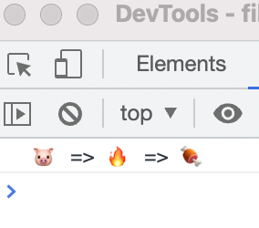
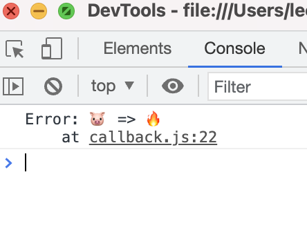

# TIL 2021 - 06 - 21 📖!

* 알고리즘
- 프로그래머스에서 최소공약수 최소 공배수 문제를 풀어보았습니다 
- 프로그래머스에서 짝수 홀수 문제를 풀어보았습니다

문제 설명
정수 num이 짝수일 경우 "Even"을 반환하고 홀수인 경우 "Odd"를 반환하는 함수, solution을 완성해주세요.

제한 조건
num은 int 범위의 정수입니다.
0은 짝수입니다

```js

function solution(num) { // num이 0이면 'Even'을 리턴하고 2%가 0이면 'Even'을 리턴하고 %2가 0이 아니면 'Odd'를 리턴합니다
    var answer = '';
    if(num === 0){
        answer = 'Even'
    }else if (num % 2 === 0){
        answer = 'Even'
    }else if(num % 2 !== 0){
        answer = 'Odd'
    }
    return answer;
}
```


문제 설명
두 수를 입력받아 두 수의 최대공약수와 최소공배수를 반환하는 함수, solution을 완성해 보세요. 배열의 맨 앞에 최대공약수, 그다음 최소공배수를 넣어 반환하면 됩니다. 예를 들어 두 수 3, 12의 최대공약수는 3, 최소공배수는 12이므로 solution(3, 12)는 [3, 12]를 반환해야 합니다.

제한 사항
두 수는 1이상 1000000이하의 자연수입니다.

입출력 예 설명
입출력 예 #1
위의 설명과 같습니다.

입출력 예 #2
자연수 2와 5의 최대공약수는 1, 최소공배수는 10이므로 [1, 10]을 리턴해야 합니다.


``` js

function solution(n, m) {
     var answer = []; 
     answer.push(gcd(n,m)) //각각 push해줍니다
     answer.push(lcm(n,m)) 
     return answer; 
}  
function gcd(minNum, maxNum){ //최소공약수를 구하는 함수
     return (minNum % maxNum) === 0 ? maxNum : gcd(maxNum, minNum % maxNum); 
     } 
function lcm(minNum, maxNum){
     return minNum * maxNum / gcd(minNum, maxNum); //최대 공약수를 구하는 함수
     }
```


* 스프린트 
-  오늘 스프린트에서는 비동기에 대해 배웠고 과제를 잘 풀고 제출했으며 callback 과 promise 와 async와 await에 대해 배웠고 복습했습니다
 

```js


 const getPig = () => 
 new Promise((resolve, reject) => {
     setTimeout(() => resolve('🐷'), 1000)
 })

 const getFire = pig => 
 new Promise((resolve, reject) => {
     setTimeout(() => resolve(`${pig} => 🔥`), 1000)
 })

 const porkMeal = fire => 
 new Promise((resolve, reject) => {
     setTimeout(() => resolve(`${fire} => 🍖`), 1000)
 })

 getPig()
 .then(pig => getFire(pig))
 .then(fire => porkMeal(fire))
 .then(console.log)
```




```js
const getPig = () => 
new Promise((resolve, reject) => {
    setTimeout(() => resolve('🐷'), 1000)
})

const getFire = pig => 
new Promise((resolve, reject) => {
    setTimeout(() => reject(new Error(`${pig} => 🔥`)), 1000) //오류가 발생 했을때
})

const porkMeal = fire => 
new Promise((resolve, reject) => {
    setTimeout(() => resolve(`${fire} => 🍖`), 1000)
})

getPig()
.then(pig => getFire(pig))
.then(fire => porkMeal(fire))
.then(console.log)
.catch(console.log) //오류내용 보여주는곳
```
이렇게 구현해서 연습해 보았습니다 . 헷갈리기는 했지만 기본을 익히니 할만 했던것 같습니다 

* 블로깅
- TIL 을 포스팅 하였습니다.
