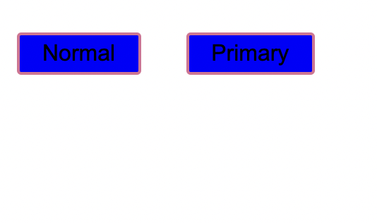
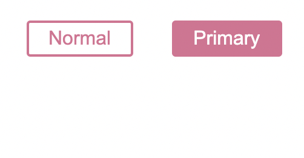
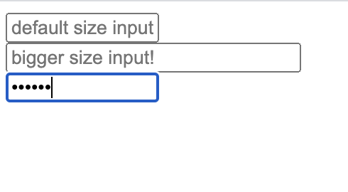
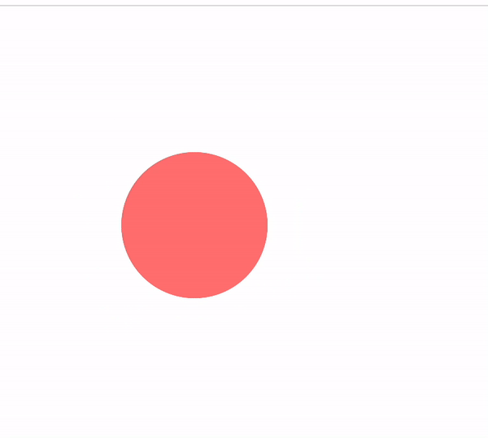
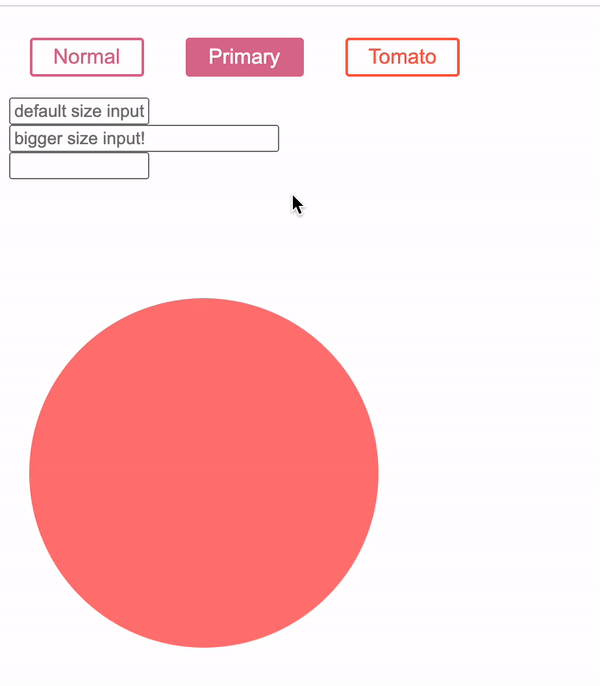

오늘은 Styled Component에 대해 배워보았습니다 다소 헷갈리는게 있지만 정리해보겠습니다 .

* Styled Component 란 무엇인가 
<br/>
styles 지정과 React component를 생성을 동시에 할 수 있는 유용한 녀석이다 

* 어떻게 사용하는가 
<br/>
 해당 레포 프로젝트 안에서 ```npm install --save styled-components```로 install 해준뒤에 ```import styled from "styled-components";``` 를 해주면 사용 할 수 있다 
 
* 프로젝트 내에서 어떻게 Styled Component로 Component 를 만들까 ? 
간단한 예로 우리가 버튼을 만든다고 하자 그러면 

```js
const Button = styled.button`
 background-color: blue;
 &:hover {
    background-color: red;
  }
  font-size: 1em;
  margin: 1em;
  padding: 0.25em 1em;
  border: 2px solid palevioletred;
  border-radius: 3px;
`;

export default function App() {
  return (
    <div className="App">
      <Button>Normal</Button>
      <Button primary>Primary</Button>
    </div>
  );
}
```

<br/>
<br/>
<br/>
이런식으로 버튼을 만들어줄 수 있다 이렇게 const 로 외부에서 선언해준 만들어준 녀석을 App함수 내에서 컴포넌트로 사용 할 수 있다 만약 저녀석이 컴포넌트 라면 props나 useState로 상태를 줄 수도 있지 않을까 ? 당연히 된다 

```js
const Button = styled.button`
  
  background: ${(props) => (props.primary ? "palevioletred" : "white")};
  color: ${(props) => (props.primary ? "white" : "palevioletred")};
  &:hover {
    background-color: red;
  }
  font-size: 1em;
  margin: 1em;
  padding: 0.25em 1em;
  border: 2px solid palevioletred;
  border-radius: 3px;
`;

export default function App() {
  return (
    <div className="App">
      <Button>Normal</Button>
      <Button primary>Primary</Button>
    </div>
  );
}
```

보다시피 두 버튼의 색깔이 다르다 Button 컴포넌트 안에 primary라는 값을 프롭스로 받아와서 primary 라는 값이 있다면 색깔과 글자색을 바꿔준것이다 . 이런식으로 useState도 사용이 가능하다. 또한 Nesting이 가능해서 hover를 넣을 때에도 &로 네스팅 할 수 있다 


네스팅이란 ? 
네스팅이란 Scss에서 사용되는 문법인데 예를들어 

```js
<div class = 'boxWrap-'>
  <div class = 'boxwrap-box1'> 
   box
  </div>
  <div class = 'boxwrap-box2'> 
   box
  </div>
  <div class = 'boxwrap-box3'> 
   box
  </div>
</div>
```
이러한 박스 wrap 안에 감싸진 box1, 2, 3 의 자식들이 있다고 가정해보자 
그러면 Css 스타일을 넣어주기 위해선 
.boxWrap- {
    //스타일
}

.boxwrap-box1{
    //스타일
}

이런식으러 스타일을 주었지만 nesting을 사용하면

.boxwrap-{
    //스타일

    &.box1{
        //스타일 
    }
}
이런식으로 자식으로 바로 스타일이 가능하다  &는 자식의 부모 이름 그 자체이다 따라서 지금 &의 값은 boxwrap- 이 된것이다 이게 Nesting인데 Styled component에서도 네스팅이 가능합니다 .


다음은 atts를 사용한 다이나믹한 컴포넌트를 만들어봅시다 
```js
const Input = styled.input.attrs(
  props => ({ type: "password",   size: props.size || "100px",
 }))` 
 width: ${props => props.size}; `; 
 

export default function App() {
  return (
    <div className="App">
      <Input placeholder="default size input!"/>
      <br/> 
      <Input placeholder="bigger size input!" size={"200px"} />
      <br/>
      <Input/>
    </div>
  );
}
 ```

<br/>
<br/>
이렇게 Input 의 타입을 지정해줄 수 있고 props 로 size의 값이 있다면 그 값으로 지정해주고 그렇지 않을때에는 100px로 지정해 줄 수 있습니다.

다음으로는 애니메이션에 대해서 알아봅시다 .

```js
import styled, {keyframes,} from "styled-components";

const bounce = keyframes`
  0% {
    transform: scale(1)
  }
  50% {
    transform: scale(0)
  }
  100% {
    transform: scale(1)
  }
`;


const Circle = styled.div`
  width: 300px;
  height: 300px;
  border-radius: 50%;
  background-color: #ff7979;
  animation: ${bounce} 2s infinite;
`;

export default function App() {
  return (
    <div className="App">
      <br/>
     <Circle/>
    </div>
  );
}
```


애니메이션을 구현 할 때에는 keyframe이라는걸 이용해서 만드는데 keyframe은 쉽게 말해 이건 애니메이션이야 ~ 라고 넣어주는겁니다 우선 Circle이라는 공을 만들어 주고 거기에 animation을 사용해서 우리가 만들어준 애니메이션을 ${}안에 넣어주기만 하면 됩니다 쉽져 ? 
그리고 ketframe을 사용하기 때문에 ```import styled, {keyframes,} from "styled-components";``` import 도 꼭 해줍시다 ! 

이렇게 Styled Component로 다이나믹하고 스타일리쉬한 Component들을 만들어 줄 수 있었습니다. 

구현해보았던것 
<br/>
<br/>
<br/>


```js
import styled, {keyframes,} from "styled-components";

const Button = styled.button`
  /* Adapt the colors based on primary prop */
  background: ${(props) => (props.primary ? "palevioletred" : "white")};
  color: ${(props) => (props.primary ? "white" : "palevioletred")};
  &:hover {
    background-color: red;
  }
  font-size: 1em;
  margin: 1em;
  padding: 0.25em 1em;
  border: 2px solid palevioletred;
  border-radius: 3px;
`;

const Tomato = styled(Button)`
  color: tomato;
  border-color: tomato;
`;

const Input = styled.input.attrs(
  props => ({ type: "password",   size: props.size || "100px",
 }))` 
 width: ${props => props.size}; `; 

const bounce = keyframes`
  0% {
    transform: scale(1)
  }
  50% {
    transform: scale(0)
  }
  100% {
    transform: scale(1)
  }
`;
 
const Circle = styled.div`
  width: 300px;
  height: 300px;
  border-radius: 50%;
  background-color: #ff7979;
  animation: ${bounce} 2s infinite;
`;


export default function App() {
  return (
    <div className="App">
      <Button>Normal</Button>
      <Button primary>Primary</Button>
      <Tomato>Tomato</Tomato>
      <br/>
      <Input placeholder="default size input!"/>
      <br/> 
      <Input placeholder="bigger size input!" size={"200px"} />
      <br/>
      <Input/>
      <br/>
      <br/>
      <br/>
      <br/>
      <br/>
     <Circle/>
    </div>
  );
}
```
