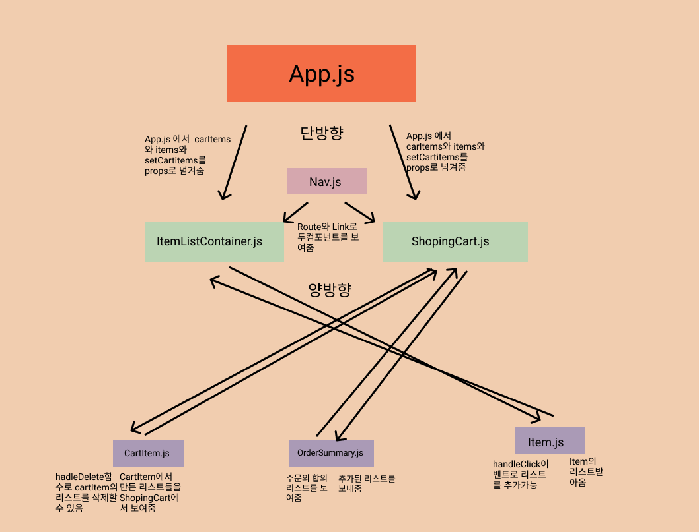

# TIL 2021 - 07 - 14 📖 !
 

 - HA를 보았다 props가 넘어가지 않아서 애를 많이 먹었다 그래서 일단 대충 테스트케이스라도 통과하자는 심정으로 하드코딩으로 때려 넣긴 했는데 어찌저찌 통과 되었고 이제는 fetch와 Api로 데이터를 받아오는게 익숙해 진것 같다 하지만 서버는 조금더 봐야하긴 할 것 같다 헷갈리는게 있었다 
 props가 왜 전달이 되진 않았는지 아직은 잘 이해가 가진 않지만 내일 좀 더 깊게 파보아야 겠다 

 - Algorithm
정수 제곱근 판별

문제 설명

임의의 양의 정수 n에 대해, n이 어떤 양의 정수 x의 제곱인지 아닌지 판단하려 합니다.
n이 양의 정수 x의 제곱이라면 x+1의 제곱을 리턴하고, n이 양의 정수 x의 제곱이 아니라면 -1을 리턴하는 함수를 완성하세요.

제한 사항
n은 1이상, 50000000000000 이하인 양의 정수입니다.

```js
function solution(n) {
    let x = Math.floor(Math.sqrt(n)); //n의 제곱근을 판별하고 정수로 만들어주는 과정  Math.sqrt 는 제곱근을 구하는 메소드
    let trueNum = Math.pow([x],[2]); // "n이 양의 정수 x의 제곱이라면 x+1의 제곱을 리턴하고" 이부분을 판별하는 과정 Math.pow 는 들어온 인자값의 , 뒤에 값 만큼 제곱하는 메소드
    
    if(n === trueNum) { // n이 위의 조건에 만족하는 수라면 
        return Math.pow([x+1],[2]); //x + 1 의 제곱을 리턴 
    } else { //아니면 -1 리턴
        return -1;
    }  
}
```

나누어 떨어지는 숫자 배열

문제 설명

array의 각 element 중 divisor로 나누어 떨어지는 값을 오름차순으로 정렬한 배열을 반환하는 함수, solution을 작성해주세요.
divisor로 나누어 떨어지는 element가 하나도 없다면 배열에 -1을 담아 반환하세요.

제한사항
arr은 자연수를 담은 배열입니다.
정수 i, j에 대해 i ≠ j 이면 arr[i] ≠ arr[j] 입니다.
divisor는 자연수입니다.
array는 길이 1 이상인 배열입니다.

```js
function solution(arr, divisor) {
    var answer = [];
    for(let i = 0 ; i < arr.length ; i++){ 
        if(arr[i]%divisor ===0){
            answer.push(arr[i])
        }//arr을 반복문으로 순회하면서 arr[i] % divisor 기 0 인값을 찾고 answer에 push 헤서 새로운 배열에 담아줍니다 
    }
    answer.sort((a,b)=>a-b) //담아준 배열을 오름차순으로 정리해주고
    
    if(answer.length === 0){ //만약 answer의 길이가 0이라면 answer에는 -1을 push해줍니다
        answer.push(-1)
    }
    return answer; 
}
```

가운데 글자 가져오기

문제 설명

단어 s의 가운데 글자를 반환하는 함수, solution을 만들어 보세요. 단어의 길이가 짝수라면 가운데 두글자를 반환하면 됩니다.

재한사항
s는 길이가 1 이상, 100이하인 스트링입니다.
```js
function solution(s) {
  let answer = "";
  if (s.length % 2 == 0) { //문자열이 짝수인경우
    answer = s[s.length / 2 - 1] + s[s.length / 2];//문자열이 짝수인 경우에는 문자열의 길이를 반으로 나눈것과 반으로나눈것의 앞에있는 인덱스 값의 문자를 answer에 할당해주고
  } else {//그렇지 않을경우는 홀수이니까 문자열의 길이의 0.5를 빼준 인덱스의 값을 answer에 할당해줍니다
    answer = s[s.length / 2 - 0.5];
  }
  return answer
}
```

