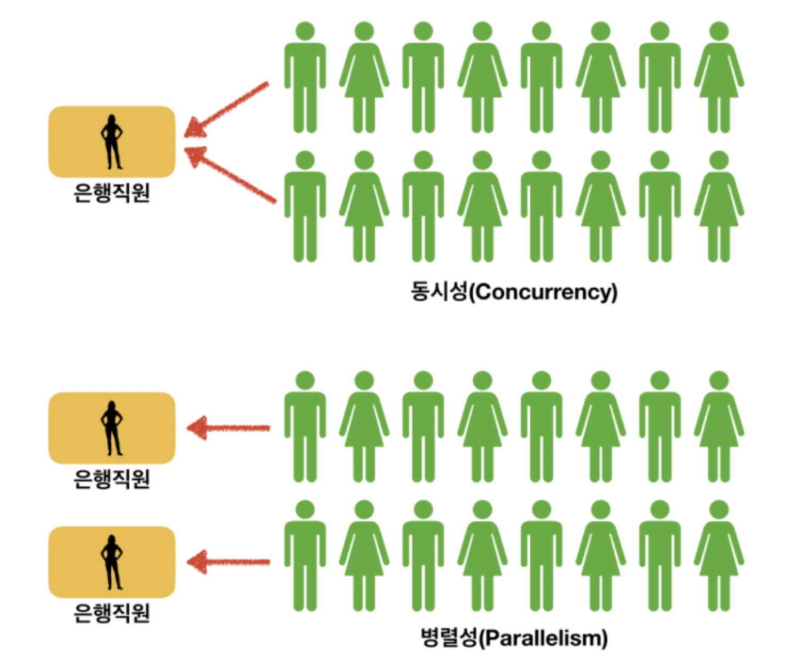

# TIL 2021 - 08 - 04  📖 !

- sprint 

- 프로그램, 프로세스, 스레드에 대해 기본적인 개념을 설명할 수 있다.
    - 프로그램(Program) 이란

      - 사전적 의미
  “ 어떤 작업을 위해 실행할 수 있는 파일”

    - 프로세스(Process) 란
   1. 사전적 의미 “컴퓨터에서 연속적으로 실행되고 있는 컴퓨터 프로그램”
 
    2. 메모리에 올라와 실행되고 있는 프로그램의 인스턴스(독립적인 개체)
    3. 운영체제로부터 시스템 자원을 할당받는 작업의 단위
    4. 즉, 동적인 개념으로는 실행된 프로그램을  의미한다. 참고 할당받는 시스템 자원의 예
         - CPU 시간
         - 운영되기 위해 필요한 주소 공간
         - Code, Data, Stack, Heap의 구조로 되어 있는 독립된 메모리 영역

       - 특징  
         - 프로세스는 각각 독립된 메모리 영역(Code, Data, Stack, Heap의 구조)을 할당받는다.
         - 기본적으로 프로세스당 최소 1개의 스레드(메인 스레드)를 가지고 있다

         - 각 프로세스는 별도의 주소 공간에서 실행되며, 한 프로세스는 다른 프로세스의 변수나 자료구조에 접근할 수 없다.
         - 한 프로세스가 다른 프로세스의 자원에 접근하려면 프로세스 간의 통신(IPC, inter-process communication)을 사용해야 한다.
         - Ex. 파이프, 파일, 소켓 등을 이용한 통신 방법 이용

            
    
  - 스레드(Thread) 란
  
    
      - 사전적 의미
      “프로세스 내에서 실행되는 여러 흐름의 단위”
      - 프로세스의 특정한 수행 경로
      - 프로세스가 할당받은 자원을 이용하는 실행의 단위
   - 특징 
       - 스레드는 프로세스 내에서 각각 Stack만 따로 할당받고 Code, Data, Heap 영역은 공유한다.
       -  스레드는 한 프로세스 내에서 동작되는 여러 실행의 흐름으로, 프로세스 내의 주소 공간이나 자원들(힙 공간 등)을 같은 프로세스 내에 스레드끼리 공유하면서 실행된다.
       - 같은 프로세스 안에 있는 여러 스레드들은 같은 힙 공간을 공유한다. 반면에 프로세스는 다른 프로세스의 메모리에 직접 접근할 수 없다.
       - 각각의 스레드는 별도의 레지스터와 스택을 갖고 있지만, 힙 메모리는 서로 읽고 쓸 수 있다.
       - 한 스레드가 프로세스 자원을 변경하면, 다른 이웃 스레드(sibling thread)도 그 변경 결과를 즉시 볼 수 있다.

    - 자바 스레드(Java Thread) 란
      - 일반 스레드와 거의 차이가 없으며, JVM가 운영체제의 역할을 한다.
      - 자바에는 프로세스가 존재하지 않고 스레드만 존재하며, 자바 스레드는 JVM에 의해 스케줄되는 실행 단위 코드 블록이다.
      - 자바에서 스레드 스케줄링은 전적으로 JVM에 의해 이루어진다.
        - 아래와 같은 스레드와 관련된 많은 정보들도 JVM이 관리한다.
        - 스레드가 몇 개 존재하는지
        - 스레드로 실행되는 프로그램 코드의 메모리 위치는 어디인지
        - 스레드의 상태는 무엇인지
        - 스레드 우선순위는 얼마인지
      - 즉, 개발자는 자바 스레드로 작동할 스레드 코드를 작성하고, 스레드 코드가 생명을 가지고 실행을 시작하도록 JVM에 요청하는 일 뿐이다.

    - 멀티 스레드
         - 하나의 응용프로그램을 여러 개의 스레드로 구성하고 각 스레드로 하여금 하나의 작업을 처리하도록 하는 것이다.
         - 윈도우, 리눅스 등 많은 운영체제들이 멀티 프로세싱을 지원하고 있지만 멀티 스레딩을 기본으로 하고 있다.
         - 웹 서버는 대표적인 멀티 스레드 응용 프로그램이다.
      - 장점
         - 시스템 자원 소모 감소 (자원의 효율성 증대)
         - 프로세스를 생성하여 자원을 할당하는 시스템 콜이 줄어들어 자원을 효율적으로 관리할 수 있다.
         - 시스템 처리량 증가 (처리 비용 감소)
         - 스레드 간 데이터를 주고 받는 것이 간단해지고 시스템 자원 소모가 줄어들게 된다.
         - 스레드 사이의 작업량이 작아 Context Switching이 빠르다.
         - 간단한 통신 방법으로 인한 프로그램 응답 시간 단축
         - 스레드는 프로세스 내의 Stack 영역을 제외한 모든 메모리를 공유하기 때문에 통신의 부담이 적다.
       - 단점
         - 주의 깊은 설계가 필요하다.
         - 디버깅이 까다롭다.
         - 단일 프로세스 시스템의 경우 효과를 기대하기 어렵다.
         - 다른 프로세스에서 스레드를 제어할 수 없다. (즉, 프로세스 밖에서 스레드 각각을 제어할 수 없다.)
         - 멀티 스레드의 경우 자원 공유의 문제가 발생한다. (동기화 문제)
         - 하나의 스레드에 문제가 발생하면 전체 프로세스가 영향을 받는다

           [출처](https://gmlwjd9405.github.io/2018/09/14/process-vs-thread.html)

    - 멀티태스킹 : 하나의 프로세서 상에서 운영체제가 여러 개의 프로세스를 번갈아가며 하나의 프로그램의 기능들을 수행해나가는 개념. 여기서 프로세서가 여러 프로세스를 돌아가며 작업을 처리하는 과정을 Context Switching이라 한다.

    - 멀티스레딩 : 하나의 프로세스를 다수의 스레드로 구분하여 프로세스의 자원을 공유하며 기능수행 능력을 향상시키는 개념
       - 공통점 : 아주 짧은 시간 간격을 두고 여러 개의 작업 흐름들을 번갈아 실행하므로 동시에 여러 개의 작업들이 실행되어지는 것처럼 보인다.(동시성 프로그래밍)

        - 차이점
          1. 멀티태스킹은 동시에 여러 개의 프로그램을 실행시키는 것처럼 보이고, 멀티스레딩은 하나의 프로그램을 여러 개의 기능으로 나누어 이를 동시에 실행시시는 것처럼 보인다는 점이 다르다.

          2. 멀티태스킹은 운영체제가 알아서 관리해주지만, 멀티스레딩은 프로그래머가 프로그램 설계시에 직접 구현을 해야한다.

          3. 멀티태스킹은 각각의 프로세스가 독립적인 메모리와 공간을 가지지만 멀티스레딩은 각각의 스레드가 공통된 프로세스의 자원들을 공유한다.

- 동시성과 병렬성의 차이를 이해할 수 있다.
   - 동시성 프로그래밍

      - 논리적인 용어이며 싱글코어 환경에서 멀티태스킹을 위해 시간을 분할해서 여러 프로세스와 스레드를 번갈아가며 실행한다. 이 과정이 너무 빠르다 보니 동시에 실행되는 것처럼 보이는 것을 말한다. 싱글 코어(멀티 코어에서도 가능)에서 멀티스레드를 동작시키키 위한 방식이다.

   - 병렬성 프로그래밍
      - 물리적으로 정확히 동시에 실행이 되는 것을 말한다. 멀티 코어에서 멀티 스레드를 실행시키는 방식이다.
    - 동시성과 병렬성의 차이
       - 동시성 프로그래밍과 병렬성 프로그래밍 모두 비동기로 동작을 구현할 수 있지만, 그 동작 원리가 다릅니다.

       | - | 동시성 | 병렬성 | 
       |---|---|---|
       | 개념 | 논리적 | 물리적 |  
       | 동작가능환경 | 싱글코어, 멀티코어 | 멀티코어 | 
        

         

- 자바스크립트 엔진(v8)이 어떤 특징을 가지고 있는지 이해할 수 있다.
   - V8 엔진
       - V8 엔진은 C++ 로 작성 되었으며, ECMA-262 에 기재된 ECMAScript 및 WebAssembly 를 처리할 수 있다.
       - V8 은 IA-32, ARM, MIPS 프로세서 를 사용하는 Windows 7 이상, macOS 10.12 이상, Linux x64 환경에서 실행이 가능하다.
       - V8 은 Chrome 이 아니더라도, 독립적으로 실행이 가능한데, 대표적인 예가 V8 으로 빌드 된 Node.js 가 있다.

    - V8의 특징
      - JavaScript 소스 코드를 컴파일 하고, 실행한다.
      - 생성하는 Object 를 메모리에 할당한다.
      - 가비지 콜렉션을 이용해 더 이상 사용되지 않는 Object 의 메모리를 해제한다.
      - Hidden Class 를 이용해 빠르게 프로퍼티에 접근한다.
      - TurboFan 을 이용해 최적화된 코드로 만들어 속도 및 메모리를 최적화한다.

- 프로그래밍에서 문자열을 다루는 방법과 유니코드 및 인코딩에 이해할 수 있다.
    - 유니코드란 ?
      - 유니코드(Unicode)는 유니코드 협회(Unicode Consortium)가 제정하는 전 세계의 모든 문자를 컴퓨터에서 일관되게 표현하고 다룰 수 있도록 설계된 산업 표준입니다. 이 표준에는 ISO 10646 문자 집합, 문자 인코딩, 문자 정보 데이터베이스, 문자를 다루기 위한 알고리즘 등을 포함하고 있습니다.
      - 인코딩(부호화)이란?
           인코딩이란 어떤 문자나 기호를 컴퓨터가 이용할 수 있는 신호로 만드는 것입니다.
           이 신호를 입력하는 인코딩과 문자를 해독하는 디코딩을 하기 위해서는 미리 정해진 기준을 바탕으로 입력과 해독이 처리되어야 합니다.
           이렇게 인코딩과 디코딩의 기준을 문자열 세트 또는 문자셋(charset)이라고 합니다. 이 문자셋의 국제 표준이  유니코드입니다.
      - ASCII 문자는 무엇인가요?
          - 영문 알파벳을 사용하는 대표적인 문자 인코딩으로 7 비트로 모든 영어 알파벳을 표현할 수 있습니다. 52개의 영문 알파벳 대소문자와, 10개의 숫자, 32개의 특수 문자, 그리고 하나의 공백 문자를 포함합니다.
          - 유니코드는 ASCII를 확장한 형태입니다.     

    - UTF-8과 UTF-16의 차이점은 무엇인가요?
         - UTF-8과 UTF-16은 인코딩 방식의 차이를 의미합니다. UTF-8은 Universal Coded Character Set + Transformation Format – 8-bit의 약자로, UTF- 뒤에 등장하는 숫자는 비트(bit)입니다
    - UTF-8
        - 인코딩하려는 문자의 코드가 속한 범위에 따라 1byte ~ 4byte로 인코딩하는 가변 길이 인코딩 방식이다. 자주 사용되는 문자는 짧은 바이트로 표현하고 그렇지 않은 문자는 긴 바이트로 표현함으로써 저장 공간을 효율적으로 사용한다. 
        - 기본적으로 첫 128개의 문자(0x0000 ~ 0x007F 범위에 속하는 ASCII 문자)들은 특별한 변형 없이 1byte에 그대로 인코딩 되기 때문에, 영어만 사용할 경우 문자 하나 당 1byte만 사용하게 된다. 그러나 만약 중동, 유럽 지역의 언어를 사용한다면 문자 하나 당 2byte를 사용하게 되고, 동아시아권 언어를 사용한다면 3byte 이상까지도 사용하게 된다
    - UTF-16
        - UTF-8이 8bit 기반의 인코딩 방식이라면, UTF-16은 16bit 기반의 인코딩 방식이다. 그렇다고 해서 16bit 고정 길이로 인코딩하는 것은 아니고, 이 역시 UTF-8과 마찬가지로 가변 길이 인코딩 방식이다. 자주 사용하는 문자는 2byte, 그렇지 않은 문자는 4byte로 표현한다. 
        - 한글을 사용함에 있어, 한글을 3byte로 표현하는 UTF-8과 달리 UTF-16은 한글을 2byte로 인코딩할 수 있기 때문에 저장 공간을 더욱 효율적으로 쓸 수 있다는 장점이 있다. 그러나 ANSI와 호환이 되지 않는 문제, Byte Ordering을 고려해야 하는 문제 등으로 인해 UTF-8보다는 사용의 복잡성이 높다는 단점이 있다. 

- 비트맵 이미지와 벡터 이미지의 차이를 이해할 수 있다.
     | - | 비트맵 | 백터 | 
     |---|---|---|
     | 기반 기술 | 픽셀 기반 | 수학적으로 계산된 Shape 기반 |  
     | 특징 | 사진과 같이 색상의 조합이 다양한이미지에 적합 | 로고, 일러스트와 같이 제품에 적용되는 이미지에 적합 |  
     | 확대 | 확대에 적합하지 않음, 보다 큰 사이즈의 이미지가 필요할 때 사용하려는 크기 이상으로 생성하거나 스캔해야함 | 품질 저하없이 모든 크기로 확대 가능하며, 해상도의 영향을 받지 않음 |  
     | 크기에 따른 파일 용량 | 큰 크기의 이미지는, 큰사이즈를 가짐 | 큰 크기의 백터 그래픽은 작은 파일 사이즈를 유지 할 수 있음 |  
     | 상호변환 | 이미지의 복잡도에 따라 백터로 변환하는 것에 오랜 시간이 걸림 | 쉽게 래스터 이미지로 변환 가능 |  
     | 대표적인 파일 포멧 | jpg, gif, png, bmp, psd | svg, ai |  
     | 웹에서의 사용성 | jpg, gif, png 등이 널리 쓰임 | svg 포맷은 현대의 브라우저에서 대부분 지원 |  
