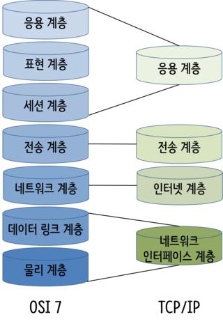

# TIL 2021 - 08 - 09  📖 !

# - sprint

- HTTP 기반 네트워크 흐름에 대해 이해할 수 있다.

  - 비연결성 ( Connectionless )
  비연결성은 클라이언트와 서버가 한 번 연결을 맺은 후, 클 라이언트 요청에 대해 서버가 응답을 마치면 맺었던 연결을 끊어 버리는 성질을 말합니다.

    1) 비연결성의 장점
    
     - HTTP는 인터넷 상에서 불특정 다수의 통신 환경을 기반으로 설계되었습니다.
       만약 서버에서 다수의 클라이언트와 연결을 계속 유지해야 한다면, 이에 따른 많은 리소스가 발생하게 됩니다.
       따라서 연결을 유지하기 위한 리소스를 줄이면 더 많은 연결을 할 수 있으므로 비연결적인 특징을 갖습니다.

     2) 비연결성의 단점

     - 물론 이로 인한 단점도 존재합니다.
     서버는 클라이언트를 기억하고 있지 않으므로 동일한 클라이언트의 모든 요청에 대해, 매번 새로운 연결을 시도/해제의 과정을 거쳐야하므로 연결/해제에 대한 오버헤드가 발생한다는 단점이 있습니다.

     3) KeppAlive

      - 이에 대한 해결책으로 오버헤드를 줄이기 위해 HTTP의 KeepAlive 속성을 사용할 수 있습니다.

         KeepAlive는 지정된 시간동안 서버와 클라이언트 사이에서 패킷 교환이 없을 경우, 상대방의 안부를 묻기위해 패킷을 주기적으로 보내는것을 말합니다.

         이 때 패킷에 반응이 없으면 접속을 끊게 됩니다.
         주기적으로 클라이언트의 상태를 체크한다는 것으로 미루어보아 KeepAlive 역시 완벽한 해결책은 아닙니다.

         KeepAlive 속성이 On 상태라해도, 서버가 바쁜 환경에서는 프로세스 수가 기하급수적으로 늘어나기 때문에 KeepAlive로 상태를 유지하기 위한 메모리를 많이 사용하게 되므로 주의해야 합니다.

  - 무상태 ( Stateless )

    1. 무상태란?
        Connectionless로 인해 서버는 클라이언트를 식별할 수가 없는데, 이를 Stateless라고 합니다.
       클라이언트의 상태를 모른다는 것은 예를 들면 다음과 같습니다.
        1. 쇼핑몰에 접속
        2. 로그인 
        3. 상품 클릭 -> 상세화면으로 이동
        4. 로그인
        5. 주문
        6. 로그인
        7. ....

       즉, 매번 새로운 인증을 해야하는 번거로움이 발생하게 됩니다.

     2. 상태를 기억하는 방법 - 쿠키

    - 서비스를 운영하려면 서버가 클라이언트를 기억해야 할 경우가 많이 있는데, 클라이언트를 기억할 수 있는 방법은 없을까요?

    - HTTP는 이러한 문제점을 해결하기 위해 브라우저 단에서 쿠키라는 것을 저장하여 서버가 클라이언트를 식별할 수 있도록 합니다.(HTTP 헤더 : set-cookie )
    
    3. 상태를 기억하는 방법 - 세션

     - 쿠키는 사용자 정보가 브라우저에 저장되기 때문에 공격자로부터 위변조의 가능성이 높아 보안에 취약합니다.

     - 이와 달리 세션은 브라우저가 아닌 서버단에서 사용자 정보를 저장하는 구조입니다.
     따라서 쿠키보다는 안전하다고 할 수 있습니다.

     - 그런데 세션 정보도 중간에 탈취 당할 수 있기 때문에 보안에 완벽하다고 할 수 없습니다.
     - 또한 세션을 사용하면 서버에 사용자 정보를 저장하므로, 서버의 메모리를 차지하게 되고, 만약 동시 접속자 수가 많은 서비스일 경우에는 서버 과부화의 원인이 됩니다.

    4.  상태를 기억하는 방법 - 토큰을 사용하는 OAuth, JWT

     - 쿠키와 세션의 문제점들을 보완하기 위해 토큰( Token )기반의 인증 방식이 도입되었습니다.

    - 토큰 기반의 인증 방식의 핵심은 보호할 데이터를 토큰으로 치환하여 원본 데이터 대신 토큰을 사용하는 기술입니다.

    - 그래서 중간에 공격자로부터 토큰이 탈취당하더라도 데이터에 대한 정보를 알 수 없으므로, 보안성을 높은 기술이라 할 수 있습니다. 대표적으로는 OAuth와 JWT이 있습니다. 


   - URL의 IP를 조회하는 순서 정리
     - 내가 이용하고있는 인터넷 제공자(ISP)의 DNS 서버(=네임서버)에게 app.mydomain.com 의 IP 주소를 알려달라고 요청.
     - 인터넷 제공자의 네임서버는 .com 으로 끝나는 URL 이므로 .com 도메인을 관리하는 네임서버에게 mydomain.com 의 IP 주소를 요청.
     - .com 도메인을 관리하는 TLD 네임서버가 mydomain.com 을 관리하는 네임서버에게 IP 주소 조회를 요청.
     - mydomain.com 의 네임서버가 IP 주소를 요청자에게 전달.
     - 요청의 역순으로 요청자들에게 IP 주소가 전달되어 최초 요청자에게 IP 주소가 전달됨.

     - TCP/IP(Transmission Control Protocol/Internet Protocol)
       - TCP/IP란 TCP규약과 IP규약을 합친 웹 상에서만 사용하는 규칙을 의미합니다.
       - TCP는 데이터 전달을 관리하는 규칙입니다. 즉, 데이터를 작게  나누어서 한쪽에서 다른쪽으로 옮기고, 이를 다시 조립하여 원래의 데이터로 만드는 규칙입니다. 여기서 잘게 나눈 데이터 단위를 패킷이라고 합니다. 인터넷에서는 정보를 전달하는 단위를 뜻합니다. TCP는 패킷을 조립하고, 손실된 패킷을 확인하고, 재전송하도록 요청하는 기능을 합니다.
       - IP는 인터넷상의 주소 규칙입니다. 집의 주소를 부여하는 규칙이 존재하듯이, 인터넷상에 연결된 모든 컴퓨터의 위치에도 규칙이 필요합니다. 이전에는 2⁸*4자리의 주소인 IPv4를 사용하였지만 주소가 고갈이 되고 있어서 16⁴*8자리인 IPv6로 전환하고 되고 있습니다.
     - TCP/IP 4계층
     

      OSI(Open Systems Interconnections)7계층은 시스템들의 연결을 위한 모델입니다. TCP/IP 4계층은 이를 웹 서비스에 맞게 단순화시킨 모델입니다.


      응용계층: HTTP, FTP, Telnet, SMTP 등 네트워크를 사용하는 응용프로그램으로 이뤄집니다.

     전송계층: TCP, UDP 등 시스템을 연결하고 데이터를 전송하는 역할을 합니다.

     인터넷계층: ICMP, IGMP, IP등 데이터를 정의하고 데이터의 경로를 라우팅합니다.

     물리계층: Ethernet, ATM등 네트워크 하드웨어를 의미합니다


     

- TCP/IP 기반 네트워크 흐름에 대해 이해할 수 있다.
     - TCP/IP 패킷이 왜 필요한 지 설명할 수 있다.
        
        - < Transfer Control Protocol / Internet Protocol > 를    줄여서 TCP/IP라고 하는데요.
        이는 인터넷 표준 프로토콜로서 컴퓨터 간의 주고받는 데이터를 전송할 때 에러가 발생하지 않도록 알맞게 나누어 전송하고 이를 수신하여 다시 기존의 정보로 변환하는 것을 약속해 놓은 것을 말합니다.

           인터넷 프로토콜 중 가장 중요한 역할을 하는 TCP와 IP의 합성어로 데이터의 흐름 관리, 정확성 확인, 패킷의 목적지 보장을 담당합니다. (데이터의 정확성 확인은 TCP가, 패킷을 목적지까지의 전송은 IP가 담당해요)

           TCP/IP는 DARPA 모델(TCP/IP를 개발한 미 정보 조직의 이름에서 유래)로 알려진 4개의 계층의 개념적인 모델에 매핑되어 있습니다. 4개의 계층은 응용(Application), 전송(Transport), 인터넷(Internet), 네트워크 인터페이스(Network Interface) 계층으로 구성됩니다.

     - TCP와 UDP의 차이에 대해 설명할 수 있다.
       - 아래의 사진과 같이 작동 합니다 .

       TCP
        

        UDP

        

        즉, 신뢰성이 요구되는 애플리케이션에서는 TCP를 사용하고 간단한 데이터를 빠른 속도로 전송하고자 하는 애플리케이션에서는 UDP를 사용합니다.

        정리 

        | TCP(Transfer Control Protocol) | UDP(User Datagram Protocol) |
        |---|---|
        | 연결이 성공해야 통신 가능(연결형 프로토콜) | 비연결형 프로토콜(연결 없이 통신이 가능) | 
        | 데이터의 경계를 구분하지 않음(Byte-Stream Service) | 데이터의 경계를 구분함(Datagram Service) | 
        | 신뢰성 있는 데이터 전송(데이터의 재전송 존재)	 | 비신뢰성 있는 데이터 전송(데이터의 재전송 없음) | 
        | 일 대 일(Unicast) 통신 | 일 대 일, 일 대 다(Broadcast), 다 대 다(Multicast) 통신 | 


- HTTP 기본 동작과 특징에 대해 이해할 수 있다.
    - HTTP 메시지 구성에 대해 설명할 수 있다.
      - Client-Server
        클라이언트와 서버는 데이터를 주고 받습니다. 클라이언트에서 한번 요청한 내용에 대해서 기억하지 않습니다. 이를 Stateless 하다고 표현합니다.
         1. Client

            요청 메시지 작성 →메시지 발송 →서버의 응답 대기 …
           메시지 수신 → 메시지 해석 → 클라이언트에서 요청 추가 처리
         2. Server

            클라이언트의 요청 대기 … 요청 메시지 수신 → 메시지 해석 → 어플리케이션에 대한 내용 처리 → 결과 반환 → 응답 메시지 작성 → 메시지 발송

       - HTTP 메시지
          HTTP메시지는 시작줄, 헤더, 본문으로 구성되어있습니다
           1. 시작줄

            - 요청 메시지
              요청 내용을 구체적으로 포함합니다.
               ```메서드, 요청 URL, HTTP 버전
                  GET /document/item/1 1.1
               ```
            - 응답 메시지
              사용자에게 일어난 내용을 응답합니다. 상태코드와 사유내용은 일대일 구조로 대응됩니다.
                ```버전, 상태코드, 사유구절
                1.1 200 OK
                ```
            - 헤더 

               메시지 본문에 대한 부가정보를 표현합니다. 헤더의 종류는 일반, 요청, 응답, 엔터티, 확장 등이 있습니다.
                 1. Connection
                    일반적으로 클라이언트와 서버간의 통신은 한번 맺고 끝납니다. 그러나 컨넥션 비용이 많이 소비되기 때문에 이를 개선하기 위하여 keep-alive옵션을 통하여 컨넥션을 재활용합니다.

                 2. Content-type
                    응답하는 컨텐츠의 유형을 의미합니다.

                 3. Cache-control
                    캐쉬 사용을 막을 것인지, 허용할 것인지 제어합니다.

                 4. Access-Control-Allow-Origin
                    클라이언트에서 현재와 다른 도메인에서 정보를 가져올 수 있는 도메인의 정보를 담고 있습니다. 이를 CORS(Cross Origin Resource Sharing)이라고 부릅니다