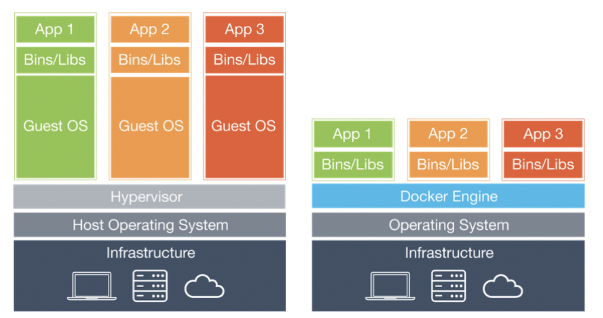

# TIL 2021 - 08 - 12  📖 !

# - sprint
- 자동 배포과정 Docker
  -  Docker란?
     - Docker는 컨테이너 기반의 오픈소스 가상화 플랫폼입니다. Docker는 소프트웨어를 container라는 표준화된 유닛으로 패키징하며, 이 container에는 라이브러리, 시스템 도구, 코드, 런타임 등 소프트웨어를 실행하는데 필요한 모든 것이 포함되어 있습니다. 
     - 즉 실행환경을 container로 추상화하고 동일한 인터페이스를 제공하여 환경에 구애받지 않고 애플리케이션을 신속하게 배포,확장 및 관리할 수 있게 해줍니다.
     - 이렇게 생성된 container는 백엔드 프로그램, 데이터베이스 서버, 메시지 큐등 어떤 프로그램도 컨테이너로 추상화할 수 있고 조립PC, AWS, Azure, Google cloud등 어디에서든 실행할 수 있습니다.
  - Container란 ? 
    - ​ 운영체계를 기반으로 만들어진 대부분의 Software는 그 실행을 위하여 OS와 Software가 사용하는 동적 Library에 대하여 의존성을 갖습니다. 
    - 즉, Software의 실행을 위해선 OS와 Library를 포함, Software가 필요로 하는 파일 등으로 구성된 실행환경이 필요한데, 하나의 시스템 위에서 둘 이상의 Software를 동시에 실행하려고 한다면 문제가 발생할 수 있습니다. 
    - 예를 들어, Software A와 B가 동일한 Library를 사용하지만 서로 다른 버전을 필요로 하는 경우라던지 두 software의 운영 체제가 다를 경우 등 다양한 경우에서 문제가 발생할 수 있습니다. 
    - 이런 상황에서가장 간단한 해결책은 두 Software를 위한 시스템을 각각 준비하는 것인데, 시스템을 각각 준비할 경우 비용의 문제가 발생하게 된다(10개의 software일 경우 10개의 시스템이 필요). 
    - 이러한 문제점을 효율적으로 해결한 것이 바로 컨테이너입니다. 컨테이너(Container)는 개별 Software의 실행에 필요한 실행환경을 독립적으로 운용할 수 있도록 기반환경 또는 다른 실행환경과의 간섭을 막고 실행의 독립성을 확보해주는 운영체계 수준의 격리 기술을 말합니다. 
    - 컨테이너는 애플리케이션을 실제 구동 환경으로부터 추상화할 수 있는 논리 패키징 메커니즘을 제공합니다.
  - 가상 머신(Virtual Machine) VS 도커 컨테이너(Docker Container)

  

     - 기존의 가상화 기술은 가상 머신(VM)이라하여 하이퍼바이저(Hypervisor)를 이용해 여러 개의 운영체제를 하나의 호스트에서 생성해 사용하는 방식이었습니다. 
     - 이 때 생성되고 관리되는 운영체제는 게스트 운영체제(Guest OS)라고 하며, 각 게스트 운영체제는 독립된 공간과 시스템 자원을 할당받아 사용합니다. 대표적인 툴로는 VirtualBox, VM Ware가 있습니다.
      - 하지만 가상 머신은 게스트 운영체제(Guest OS)를 사용하기 위해 커널과 라이브러리 등이 포함이 되기 때문에 무겁고 용량이 큽니다, 
     - 대신에 도커 컨테이는 가상화 공간을 만들기 위해 리눅스의 자체 기능인 chroot, namespace, cgroup을 사용하기 때문에 성능 손실이 거의 없으며, 컨테이너에 필요한 커널은 호스트 운영체제의 커널을 공유해 사용 하기 때문에, 가볍습니다
     - 도커는 가상 머신만큼 견고한 격리성을 제공하지는 않습니다.
     - 도커는 리눅스의 컨테이너(Linux Container)를 이용한 기술로, OS 위에 다른 OS를 실행하는 것이 아니므로 가상 머신보다 좋은 성능을 낼 수 있습니다.
     - 애플리케이션에 대한 환경 격리성을 중심으로 한 VM과는 달리, 도커는 Container의 관점에서 개발자와 사용자 커뮤니티를 중심으로 혜택을 제공하는 데 있습니다

    || 컨테이너의 이점 | 가장머신의 이점 |
    |---|---|---|
    | 일관성 있는 런타임 환경 | O | O | 
    | 애플리케이션 샌드박스화 | O | O | 
    | 디스크 용량 절감 | O | X | 
    | 낮은 오버헤드 | O | X | 

  - Container를 사용하는 이유? 
     - Linux Container는 Linux 기반의 기술 중 하나로, 필요한 라이브러리와 애플리케이션을 모아서 마치 별도의 서버처럼 구성한 것을 말합니다. 
     - 컨테이너를 이루는 네트워크 설정, 환경 변수 등의 시스템 자원은 각 컨테이너가 독립적으로 소유하고 있습니다.
     - 프로세스의 구획화
       - 특정 컨테이너에서 작동하는 프로세스는 기본적으로 그 컨테이너 안에서만 액세스 할 수 있습니다.
       - 컨테이너 안에서 실행되는 프로세스는 다른 컨테이너의 프로세스에게 영향을 줄 수 없습니다.
     - 네트워크의 구획화
       - 기본으로 컨테이너 하나에 IP 주소가 할당되어 있습니다.
     - 파일 시스템의 구획화
       - 컨테이너 안에서 사용되는 파일 시스템은 구획화되어 있습니다. 그래서 해당 컨테이너에서의 명령이나 파일 등의 액세스를 제한할 수 있습니다.
  - Docker 는 어떤 문제를 해결할 수 있나요?
    - 환경 표준화 
    - 수작업으로 일치시키는 환경 구성
    - 리소스 격리성
  - 이미지(Image)
     - 이미지는 컨테이너 실행에 필요한 파일과 설정값등을 포함하고 있는 것으로 상태값을 가지지 않고 변하지 않습니다(Immutable). 컨테이너는 이미지를 실행한 상태라고 볼 수 있고 추가되거나 변하는 값은 컨테이너에 저장됩니다. 
     - 같은 이미지에서 여러개의 컨테이너를 생성할 수 있고 컨테이너의 상태가 바뀌거나 컨테이너가 삭제되더라도 이미지는 변하지 않고 그대로 남아있습니다.
     - 도커이미지의 용량은 보통 수백 MB ~ 수GB가 넘지만 가상머신의 이미지에 비하면 굉장히 적은 용량
     - 이미지는 상태값을가지지 않고 변하지 않음
     - 하나의 이미지는 여러 컨테이너를 생성 할 수 있고 컨테이너가 삭제되더라도 이미지는 변하지 않고 그대로 남아있음
     - 도커 이미지들은 github와 유사한 서비스인 DockerHub를 통해 버전 관리 및 배포가 가능하다
     - 다양한 API가 제공되어 원하는 만큼 자동화가 가능하다 
     - 도커는 Dockerfile 이라는 파일로 이미지를 만든다 . Dockerfile에는 소스와 함께 의존성 페키지등 사용했던 설정 파일을 버전 관리 하기 쉽도록 명시되어진다. 
     - 이미지와 레이어 
       - 레이어란 기존이미지에 추가적인 파일이 필요 할 때 다시 다운로드 받는 방법이 아닌 해당 파일을 추가하기 위한 개념이다. 이미지는 여러개의 읽기전용 layer로 구성되고 파일이 추가 되면 새로운 layer가 생성됩니다 
       - 도커는 여러개의 layer를 묶어서 하나의 파일시스템으로 사용 할 수 있게 해줍니다
       - 이미지와 레이어는 같은 의미로 사용되고 DockerHub 및 개인 저장소에서 이미지를 공유 할 때는 바뀐부분만 주고받기가 가능합니다 
     - imgae의 형식
     ```
     [저장소 이름]/[이미지 이름]:[태그]
     geonwoo/ubuntu:14:04
     ```
     테그가 없을 경우 latest로 붙습니다 ex: geonwoo/ubuntu:latest
  - Docker 명령어 
    - docker login 하기 
       ```
       docker login
       ```
    -  docker/whalesay의 최신 이미지를 받아오기.
      ```
      docker image pull docker/whalesay:latest
      docker pull [이미지 이름]:[태그]
      ```
      이미지를 pull 하는 방식입니다 . 
      {image} pull : 레지스트리에서 이미지 혹은 레포지토리를 가져옵니다(pull)
    - 이미지 리스트 출력하기
      ```
      docker image ls
      docker images
      ```
    - docker 컨테이너 생성하기 
       ```
       docker create [옵션] [이미지 이름]:[태그]
       ```

    - geonwooPractice 라는 이름을 이름으로 갖는 컨테이너 만들고 실행하기
     ```
     docker container run --name geonwooPractice docker/whalesay:latest cowsay boo
     docker run [옵션] [이미지 이름]:[태그] 
     ```
     - 컨테이너 목록 확인 
     ```
     docker ps -a
     -q : 컨테이너 ID만 출력
     -a : 컨테이너 전체 출력
     ```
     ```
     CONTAINER ID   IMAGE     COMMAND   CREATED   STATUS    PORTS     NAMES
     ```
     저는 지금 컨테이너가 없어서 이렇게 보이지만 저런 형식으로 보이게 됩니다
       - CONTAINER ID : 컨테이너에게 자동으로 할당되는 고유한 ID
       - IMAGE : 컨테이너를 생성할 때 사용된 이미지 이름
       - COMMAND : 컨맨드는 컨테이너가 시작될 때 실행될 명렁어, 기본은 /bin/bash 명령어라 명령을 쓸 수 있습니다.
       - CREATED : 컨테이너가 생성되고 난 뒤 흐른 시간
       - STATUS : 컨테이너의 상태 ex) Up(실행 중), Exited(종료), Pause(일시 중지)
       - PORTS : 컨테이너가 개방한 포트와 호스트에 연결한 포트
       - NAMES : 컨테이너의 고유한 이름, --name 옵션으로 이름을 설정하지 않으면 도커 엔진이 임의의로 설정
   - 컨테이너 이름 변경
      ```
      docker rename [기존 이름] [변경 하고자 하는 이름]
      ```
    - 컨테이너 삭제 
     ```
     docker container rm 컨테이너_이름
     강제 삭제 
     docker container rm -f [컨테이너 이름]
     ```
   - 이미지삭제 
      ```
      docker image rm
      ```
   - 웹서버에서 소스코드 받아와 다루기 
     1. 소스코드 클론
     2. 컨테이너 실행
      ```
      docker container run --name 컨테이너_이름 -p 818:80 httpd
      ```
      - -p 다음 구절인 818:80은 818 부분은 실제 로컬호스트가 알아보는 포트 이고 뒷부분인 80은 docker container가 실질적으로 사용하고 있는 포트입니다 따라서 컨테이너간의 격리성을 보장해주는 docker 특성상 앞의 포트번호만 다르면 뒤의 포트번호가 같아도 격리되어 있기 때문에 실행하는데 문제 없습니다 . 818:80 과 3000:80은 80포트를 같이 쓰지만 격리성 보장의 특징상 실행의 문제가 없다는 이야기입니다 .

     3. 다른 터미널을 열어 소스코드에 진입 한 후에 아래와같은 명령어를 입력하여 
       ```
       docker container cp ./ 컨테이너_이름:/usr/local/apache2/htdocs/
       ``` 
     - 파일 복사하기

