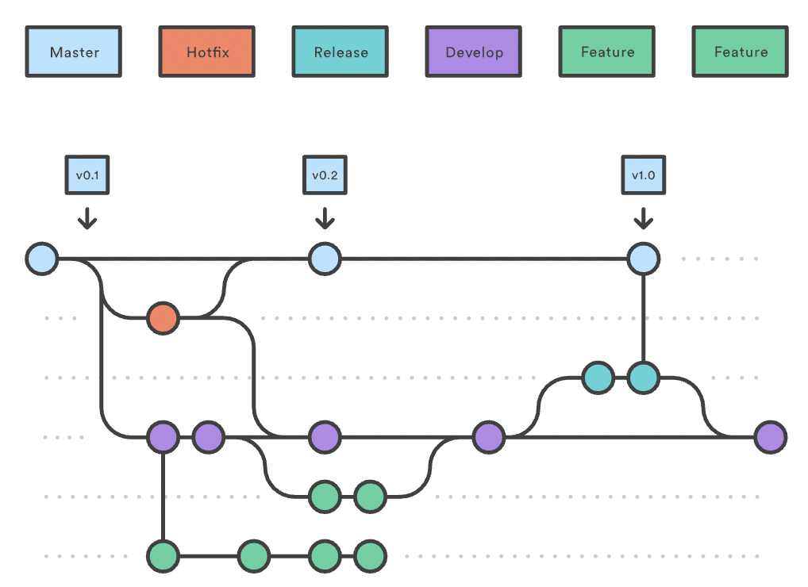
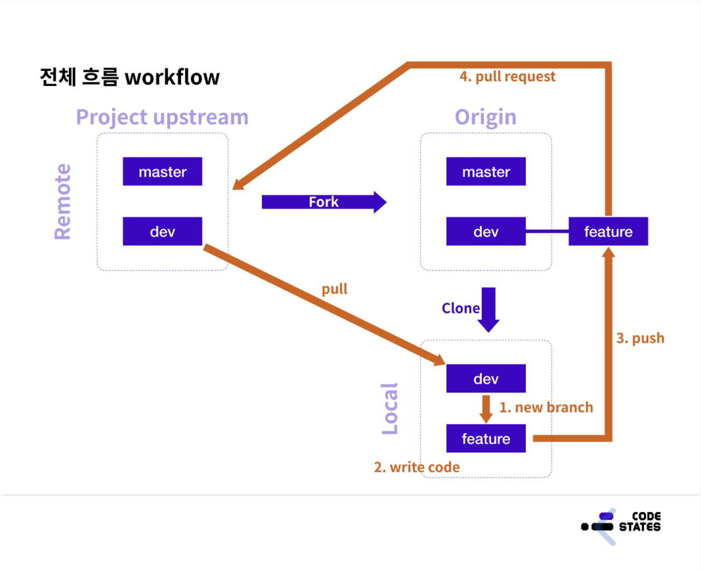

# TIL 2021 - 08 - 10  📖 !

# - sprint
- 브랜치란?
    - 브랜치란 독립적으로 어떤 작업을 진행하기 위한 개념입니다.
    - 개발을 하다 보면 한 페이지 안의 여러 기능을 따로 구현하기  위해, 코드를 여러 개로 복사해야 하는 일이 자주 생깁니다.
     - 브랜치 기능을 활용하면, 코드를 통째로 복사한 후 원래 코드가 변경될 우려 없이 독립적으로 개발할 수 있습니다.
    - 다시 말해, 각각의 브랜치는 다른 브랜치의 영향을 받지 않기  때문에, 여러 작업을 동시에 진행할 수 있습니다.
    - 브랜치 기능의 장점은 다음과 같습니다.
      - 한 소스코드에서 동시에 다양한 작업을 할 수 있게 해준다.
      - 소스코드의 한 시점과 동일한 상태를 만들고, 브랜치를     넘나들며 작업을 수행할 수 있다.
      - 각각의 브랜치에서 생긴 변화가 다른 브랜치에 영향을 주지 않고 독립적으로 코딩을 진행할 수 있다.
- 브랜치의 종류 
    1. Master Branch
         - 제품으로 출시될 수 있는 브랜치
         - 배포(Release) 이력을 관리하기 위해 사용. 즉, 배포 가능한 상태만을 관리한다. 
    2. Develop Branch
        - 다음 출시 버전을 개발하는 브랜치
        - 기능 개발을 위한 브랜치들을 병합하기 위해 사용. 즉,  모든 기능이 추가되고 버그가 수정되어 배포 가능한 안정적인 상태라면 develop 브랜치를 ‘master’ 브랜치에 병합(merge)한다.
        - 평소에는 이 브랜치를 기반으로 개발을 진행한다.
    3. Feature branch
        - 기능을 개발하는 브랜치
        - feature 브랜치는 새로운 기능 개발 및 버그 수정이 필요할 때마다 ‘develop’ 브랜치로부터 분기한다. feature 브랜치에서의 작업은 기본적으로 공유할 필요가 없기 때문에, 자신의 로컬 저장소에서 관리한다.
        - 개발이 완료되면 ‘develop’ 브랜치로 병합(merge)하여 다른 사람들과 공유한다.
        - ‘develop’ 브랜치에서 새로운 기능에 대한 feature 브랜치를 분기한다.
        - 새로운 기능에 대한 작업 수행한다.
            - 작업이 끝나면 ‘develop’ 브랜치로 병합(merge)한다.
            - 더 이상 필요하지 않은 feature 브랜치는 삭제한다.
            - 새로운 기능에 대한 ‘feature’ 브랜치를 중앙 원격 저장소에 올린다.(push)
            - feature 브랜치 이름 정하기
        - feature 브랜치 생성 및 종료 과정
        ```
        // feature 브랜치(feature/login)를 'develop' 브랜치('master' 브랜치에서 따는 것이 아니다!)에서 분기
        $ git checkout -b feature/login develop

        /* ~ 새로운 기능에 대한 작업 수행 ~ */

        /* feature 브랜치에서 모든 작업이 끝나면 */
        // 'develop' 브랜치로 이동한다.
        $ git checkout develop
        // 'develop' 브랜치에 feature/login 브랜치 내용을 병합(merge)한다.
        # --no-ff 옵션: 아래에 추가 설명
        $ git merge --no-ff feature/login
        // -d 옵션: feature/login에 해당하는 브랜치를 삭제한다.
        $ git branch -d feature/login
        // 'develop' 브랜치를 원격 중앙 저장소에 올린다.
        $ git push origin develop
        ```
    - --no-ff 옵션
       - 새로운 커밋 객체를 만들어 ‘develop’ 브랜치에 merge 한다.
       - 이것은 ‘feature’ 브랜치에 존재하는 커밋 이력을 모두 합쳐서 하나의 새로운 커밋 객체를 만들어 ‘develop’ 브랜치로 병합(merge)하는 것이다.
    4. Release Branch
       - 이번 출시 버전을 준비하는 브랜치
       - 배포를 위한 전용 브랜치를 사용함으로써 한 팀이 해당 배포를 준비하는 동안 다른 팀은 다음 배포를 위한 기능 개발을 계속할 수 있다. 즉, 딱딱 끊어지는 개발 단계를 정의하기에 아주 좋다.
       - 예를 들어, ‘이번 주에 버전 1.3 배포를 목표로 한다!’라고 팀 구성원들과 쉽게 소통하고 합의할 수 있다는 말이다.
       - ‘develop’ 브랜치에서 배포할 수 있는 수준의 기능이 모이면 또는 정해진 배포 일정이 되면, release 브랜치를 분기한다.
       - release 브랜치를 만드는 순간부터 배포 사이클이 시작된다.
       - release 브랜치에서는 배포를 위한 최종적인 버그 수정, 문서 추가 등 릴리스와 직접적으로 관련된 작업을 수행한다.
       - 직접적으로 관련된 작업들을 제외하고는 release 브랜치에 새로운 기능을 추가로 병합(merge)하지 않는다.
       - ‘release’ 브랜치에서 배포 가능한 상태가 되면(배포 준비가 완료되면),
       - 배포 가능한 상태: 새로운 기능을 포함한 상태로 모든 기능이 정상적으로 동작 하는 상태
       ‘master’ 브랜치에 병합한다. (이때, 병합한 커밋에 Release 버전 태그를 부여!)
       - 배포를 준비하는 동안 release 브랜치가 변경되었을 수 있으므로 배포 완료 후 ‘develop’ 브랜치에도 병합한다.
       - 이때, 다음 번 배포(Release)를 위한 개발 작업은 ‘develop’ 브랜치에서 계속 진행해 나간다.
    - release 브랜치 이름 정하기
       - release-RB__ 또는 release-_ 또는 release/* 처럼 이름 짓는 것이 일반적인 관례
       - release 브랜치 생성 및 종료 과정
       ```
       // release 브랜치(release-1.2)를 'develop' 브랜치('master' 브랜치에서 따는 것이 아니다!)에서 분기
       $ git checkout -b release-1.2 develop

       /* ~ 배포 사이클이 시작 ~ */

       /* release 브랜치에서 배포 가능한 상태가 되면 */
       // 'master' 브랜치로 이동한다.
       $ git checkout master
       // 'master' 브랜치에 release-1.2 브랜치 내용을 병합(merge)한다.
       # --no-ff 옵션: 위의 추가 설명 참고
       $ git merge --no-ff release-1.2
       // 병합한 커밋에 Release 버전 태그를 부여한다.
       $ git tag -a 1.2

       /* 'release' 브랜치의 변경 사항을 'develop' 브랜치에도 적용 */
       // 'develop' 브랜치로 이동한다.
       $ git checkout develop
       // 'develop' 브랜치에 release-1.2 브랜치 내용을 병합(merge)한다.
       $ git merge --no-ff release-1.2
       // -d 옵션: release-1.2에 해당하는 브랜치를 삭제한다.
       $ git branch -d release-1.2
       ```
    5. Hotfix Branch
      - 출시 버전에서 발생한 버그를 수정 하는 브랜치
          - 배포한 버전에 긴급하게 수정을 해야 할 필요가 있을 경우, ‘master’ 브랜치에서 분기하는 브랜치이다. ‘develop’ 브랜치에서 문제가 되는 부분을 수정하여 배포 가능한 버전을 만들기에는 시간도 많이 소요되고 안정성을 보장하기도 어려우므로 바로 배포가 가능한 ‘master’ 브랜치에서 직접 브랜치를 만들어 필요한 부분만을 수정한 후 다시 ‘master’브랜치에 병합하여 이를 배포해야 하는 것이다.
          - 배포한 버전에 긴급하게 수정을 해야 할 필요가 있을 경우,
          ‘master’ 브랜치에서 hotfix 브랜치를 분기한다. (‘hotfix’ 브랜치만 master에서 바로 딸 수 있다.)
          - 문제가 되는 부분만을 빠르게 수정한다.
          - 다시 ‘master’ 브랜치에 병합(merge)하여 이를 안정적으로 다시 배포한다.
          - 새로운 버전 이름으로 태그를 매긴다.
          - hotfix 브랜치에서의 변경 사항은 ‘develop’ 브랜치에도 병합(merge)한다.
    - git branch map
       
    - git 명령어 
      - 새로운 브랜치 생성
         - $ git branch 새로운 브랜치 이름
      - 새로운 브랜치 생성 후 해당 브랜치로 전환
         - $ git switch -c 새로운 브랜치 이름
         - $ git checkout -b 새로운 브랜치 이름
      - 브랜치 목록 확인
         - $ git branch
      - 브랜치 목록과 각 브랜치의 최근 커밋 확인
         - $ git branch -v
      - 브랜치 삭제
         - $ git branch -d 삭제할 브랜치 이름
         - $ git branch -D 해당 명령어는 병합하지 않은 브랜치를 강제 삭제하는 방법입니다.
      - 브랜치 전환
         - $ git switch 브랜치 이름
         - $ git checkout 브랜치 이름
      - 브랜치 병합
         - master 브랜치로 dev 브랜치를 병합할 때 (master ← dev)
         - $ git checkout master
         - $ git merge dev
      - 로그에 모든 브랜치를 그래프로 표현
         - $ git log --branches --graph --decorate
         - 아직 commit 하지 않은 작업을 스택에 임시로 저장
         - $ git stash
      - 커밋의 베이스를 다시 정하고 싶은 경우
         - $ git rebase 
      - 여러 개의 커밋 로그를 하나로 묶고 싶은 경우
         - $ git squash
      - 커밋 여러 개의 변경 사항을 취소 하고 싶은경우
         - $ git revert
      -최근 커밋 메세지를 수정하고 싶은 경우
         - $ --amend  
        
    - git 작업 순서 map : 출처 codestates 수업자료  

    

    - 번외 rebase와 merge의 차이 
       - Merge
           - 말 그래도 브런치들을 병합하는 것이다.
           - commit history로 같이 병합 된다.
       - Rebase
           - base을 교체 함으로 브런치를 병합한다.
           - base는 브런치가 생성될 때 기준점을 의미한다.
           - base가 바뀜으로 인해 commit history에 변경이 생긴다
       - 주의
           - 일반적인 로컬 브랜치에서 작업할 때는 히스토리를 정리하기 위해서 Rebase 할 수도 있지만, 리모트 등 어딘가에 Push로 내보낸 커밋에 대해서는 절대 Rebase 하지 말아야 한다.
